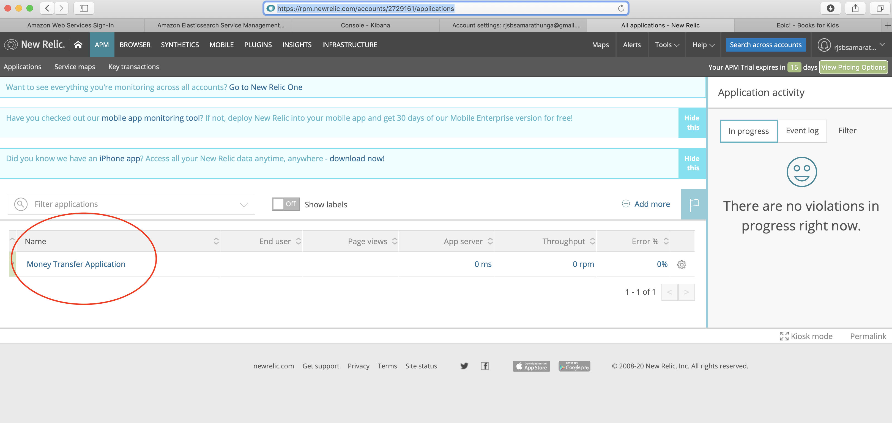
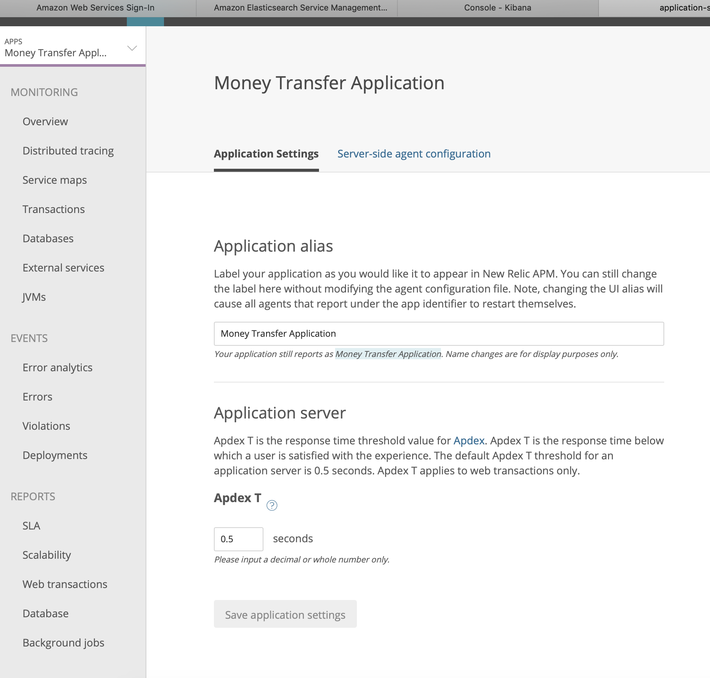
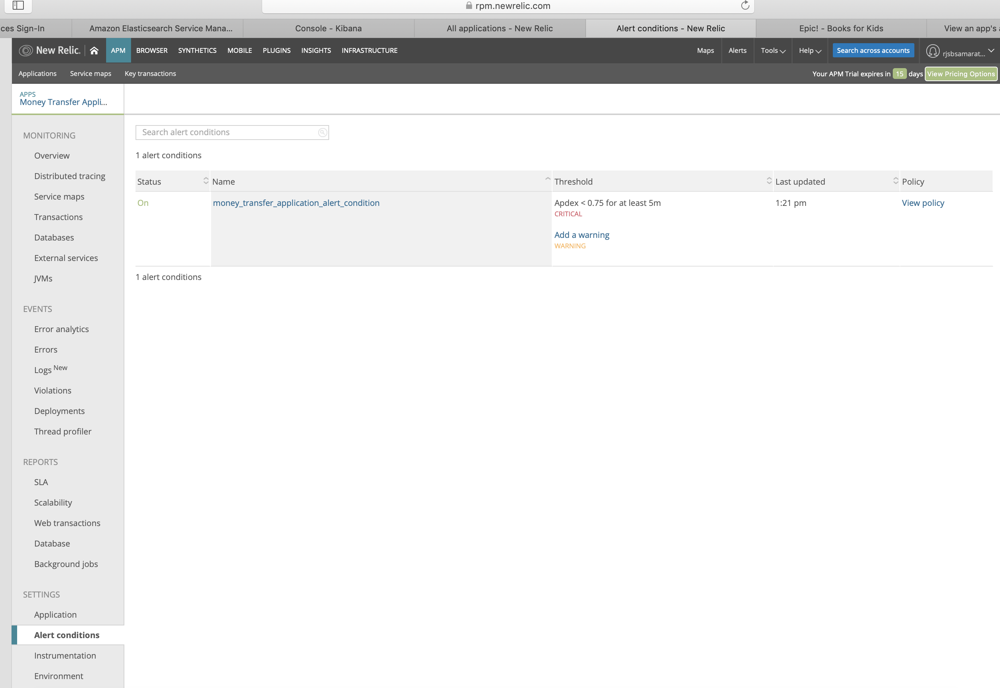
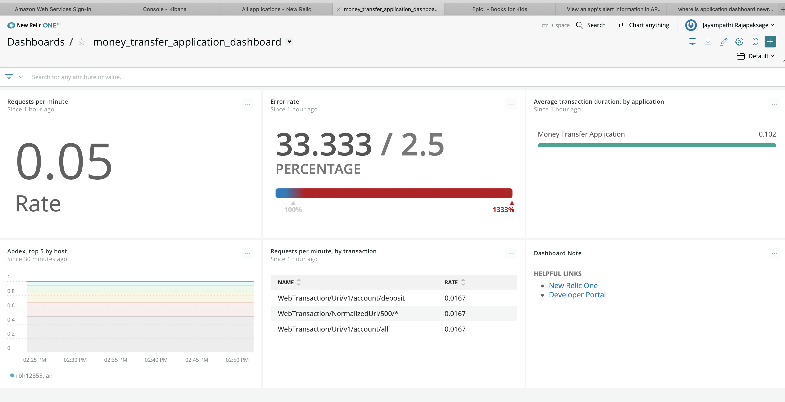

# Newrelic APM
This tutorial show how to integrate newrelic to your springboot application and how to setup alerts using terraform

## get you java application ready
First you need to create an app that needs newrelic integration. instead i downloaded one from 
https://medium.com/@sujit_tripathy/configuring-new-relic-in-java-application-e2174cf1515
git: https://github.com/sujittripathy/sparkjava-demo-money-transfer


## instrument with newrelic

Add following to pom.xml dependencies (already there):

```xml
 <dependency>
    <groupId>com.newrelic.agent.java</groupId>
    <artifactId>newrelic-agent</artifactId>
    <version>4.12.0</version>
</dependency>
```

Add folliwing to pom.xml build (not there in downloadec project). This takes care of copying newrelic.jar to base directory. if you need it in build dir

```xml
<plugin>
    <groupId>org.apache.maven.plugins</groupId>
    <artifactId>maven-dependency-plugin</artifactId>
    <version>3.1.1</version>
    <executions>
        <execution>
            <id>unpack-newrelic</id>
            <phase>package</phase>
            <goals>
                <goal>copy</goal>
            </goals>
            <configuration>
                <artifactItems>
                    <artifactItem>
                        <groupId>com.newrelic.agent.java</groupId>
                        <artifactId>newrelic-agent</artifactId>
                        <overWrite>true</overWrite>
                        <outputDirectory>${project.basedir}</outputDirectory>
                        <!-- if you need build dir instead of base dir:-->
                        <!-- <outputDirectory>${project.build.directory}</outputDirectory>-->
                        <destFileName>newrelic.jar</destFileName>
                    </artifactItem>
                </artifactItems>
                <!-- other configurations here -->
            </configuration>
        </execution>
    </executions>
</plugin>
```

Update your application name and newrelic.yml :

```yml
license_key: xxx
app_name: Money Transfer Application
```

## run application
Add following to VM Options (in intellij run config of com.demo.MoneyTransferMain):
`-javaagent:newrelic.jar`

and run MoneyTransferMain through intellij  or do it commandline:

`mvn install -DskipTests`
`java -javaagent:newrelic.jar -jar target/sparkjava-demo-money-transfer-1.0.jar`

If everything works fine you get message:

```bash
May 26, 2020 12:16:12 -0500 [69913 1] com.newrelic INFO: New Relic Agent: Loading configuration file "newrelic.yml"
May 26, 2020 12:16:12 -0500 [69913 1] com.newrelic INFO: Using default collector host: collector.newrelic.com
May 26, 2020 12:16:12 -0500 [69913 1] com.newrelic INFO: New Relic Agent: Writing to log file: /Users/rdissanayakam/.m2/repository/com/newrelic/agent/java/newrelic-agent/4.12.0/logs/newrelic_agent.log
```

App will start at `port 4567` and the apis can be accessed via `http://localhost:4567/<api path>`

Now you should be able to see app appearing in newrelic website> apm:

https://rpm.newrelic.com/accounts/2729161/applications



**API Details**
Account:

- Add a new user - POST - http://localhost:4567/v1/account/add
- Fetch all account details - GET - http://localhost:4567/v1/account/all
- Fetch details on a single account - GET - http://localhost:4567/v1/account/100000
- Make a deposit - POST - http://localhost:4567/v1/account/deposit
- Make a withdraw - POST - http://localhost:4567/v1/account/withdraw
- Close account - PUT - http://localhost:4567/v1/account/100000/close

Transfer:

- Make a transfer - POST - http://localhost:4567/v1/transfer/immediate
- Make a scheduled transfer - POST - http://localhost:4567/v1/transfer/schedule
- Get details from an existing transfer - GET - http://localhost:4567/v1/transfer/10000002

`AccountRoutes.java` and `TransferRoutes.java` has which params needed etc.

##### Apdex
https://docs.newrelic.com/docs/apm/new-relic-apm/apdex/apdex-measure-user-satisfaction

Apdex T is the central value for Apdex. `Apdex T is the response time above which a transaction is considered "tolerable`.

Go to `rpm.newrelic.com/apm ` . Next, from the index of applications, select the app's gear icon, then select View settings > Application settings.

https://blog.newrelic.com/product-news/best-practices-new-relic-alert-conditions/




## Create alert using terraform
`terraform init`> `terraform plan` > `terraform apply` apm-newrelic.tf

```json
provider "newrelic" {
  api_key = "${var.newrelic_api_key}"
}

provider "aws" {
  region = "us-east-1"
}

terraform {
  required_version = ">= 0.11.0"
}

data "aws_region" "current" {}

data "aws_caller_identity" "current" {}

variable "newrelic_api_key" {
  default = "xxx"
}
data "newrelic_application" "money_transfer_application" {
  name = "Money Transfer Application"
}

resource "newrelic_alert_policy" "money_transfer_application_policy" {
  name = "money_transfer_application_policy"
}

resource "newrelic_alert_condition" "money_transfer_application_alert_condition" {
  policy_id = "${newrelic_alert_policy.money_transfer_application_policy.id}"

  name            = "money_transfer_application_alert_condition"
  type            = "apm_app_metric"
  entities        = ["${data.newrelic_application.money_transfer_application.id}"]
  metric          = "apdex"
  condition_scope = "application"

  term {
    duration      = 5
    operator      = "below"
    priority      = "critical"
    threshold     = "0.75"
    time_function = "all"
  }
}

resource "newrelic_alert_channel" "money_transfer_application_alert_notification_email" {
  name = "dmrhimali@gmail.com"
  type = "email"

  config {
    recipients              = "dmrhimali@gmail.com"
    include_json_attachment = "1"
  }
}

resource "newrelic_alert_policy_channel" "alert_policy_email" {
  policy_id = "${newrelic_alert_policy.money_transfer_application_policy.id}"

  channel_ids = [
    "${newrelic_alert_channel.money_transfer_application_alert_notification_email.id}",
  ]
}

```

Go to `rpm.newrelic.com/apm`  > in row of app > select the app's gear icon > Alert conditions. 




## Create dsashbord:

add following to apm-newrelic.tf:

```json
resource "newrelic_dashboard" "exampledash" {
  title = "money_transfer_application_dashboard"

  filter {
    event_types = [
        "Transaction"
    ]
    attributes = [
        "appName",
        "name"
    ]
  }

  widget {
    title = "Requests per minute"
    visualization = "billboard"
    nrql = "SELECT rate(count(*), 1 minute) FROM Transaction"
    row = 1
    column = 1
  }

  widget {
    title = "Error rate"
    visualization = "gauge"
    nrql = "SELECT percentage(count(*), WHERE error IS True) FROM Transaction"
    threshold_red = 2.5
    row = 1
    column = 2
  }

  widget {
    title = "Average transaction duration, by application"
    visualization = "facet_bar_chart"
    nrql = "SELECT average(duration) FROM Transaction FACET appName"
    row = 1
    column = 3
  }

  widget {
    title = "Apdex, top 5 by host"
    duration = 1800000
    visualization = "metric_line_chart"
    entity_ids = [
      "${data.newrelic_application.money_transfer_application.id}",
    ]
    metric {
        name = "Apdex"
        values = [ "score" ]
    }
    facet = "host"
    limit = 5
    row = 2
    column = 1
  }

  widget {
    title = "Requests per minute, by transaction"
    visualization = "facet_table"
    nrql = "SELECT rate(count(*), 1 minute) FROM Transaction FACET name"
    row = 2
    column = 2
  }

  widget {
    title = "Dashboard Note"
    visualization = "markdown"
    source = "### Helpful Links\n\n* [New Relic One](https://one.newrelic.com)\n* [Developer Portal](https://developer.newrelic.com)"
    row = 2
    column = 3
  }
}
```

go to `one.newrelic.com` > dashboards > money_transfer_application_dashboard




FREE TRAINING : https://learn.newrelic.com/series/fundamentals
