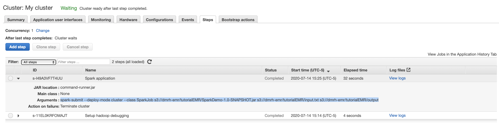

# Spark job in EMR

## Manual setup to run spark job in EMR

VIDEO: https://www.youtube.com/watch?v=An8tw4lEkaI

Totorial: 

- https://medium.com/big-data-on-amazon-elastic-mapreduce/run-a-spark-job-within-amazon-emr-in-15-minutes-68b02af1ae16

- https://towardsdatascience.com/end-to-end-distributed-ml-using-aws-emr-apache-spark-pyspark-and-mongodb-tutorial-with-4d1077f68381


## Create spark application

This project is  in `tutorial/SparkDemo` folder. it can be opened in intellij for exploration.

this is how i created it:
in intellij > new > maven application > 

add to `pom.xml` :

```xml
<dependencies>

        <!-- Import Spark -->
        <!-- https://mvnrepository.com/artifact/org.apache.spark/spark-core -->
        <dependency>
            <groupId>org.apache.spark</groupId>
            <artifactId>spark-core_2.12</artifactId>
            <version>2.4.6</version>
        </dependency>

        <!-- https://mvnrepository.com/artifact/org.apache.spark/spark-sql -->
        <dependency>
            <groupId>org.apache.spark</groupId>
            <artifactId>spark-sql_2.12</artifactId>
            <version>2.4.6</version>
        </dependency>

        <dependency>
            <groupId>junit</groupId>
            <artifactId>junit</artifactId>
            <version>4.11</version>
            <scope>test</scope>
        </dependency>

    </dependencies>

    <build>
        <plugins>
            <plugin>
                <groupId>org.apache.maven.plugins</groupId>
                <artifactId>maven-compiler-plugin</artifactId>
                <version>2.0.2</version>
                <configuration>
                    <source>1.8</source>
                    <target>1.8</target>
                </configuration>
            </plugin>
            <plugin>
                <groupId>org.apache.maven.plugins</groupId>
                <artifactId>maven-jar-plugin</artifactId>
                <configuration>
                    <archive>
                        <manifest>
                            <addClasspath>true</addClasspath>
                            <classpathPrefix>lib/</classpathPrefix>
                            <mainClass>com.geekcap.javaworld.sparkexample.WordCount</mainClass>
                        </manifest>
                    </archive>
                </configuration>
            </plugin>
            <plugin>
                <groupId>org.apache.maven.plugins</groupId>
                <artifactId>maven-dependency-plugin</artifactId>
                <executions>
                    <execution>
                        <id>copy</id>
                        <phase>install</phase>
                        <goals>
                            <goal>copy-dependencies</goal>
                        </goals>
                        <configuration>
                            <outputDirectory>${project.build.directory}/lib</outputDirectory>
                        </configuration>
                    </execution>
                </executions>
            </plugin>
        </plugins>
    </build>
```

Add java file to SparkDemo/src/main/java:

```java
import org.apache.spark.api.java.JavaPairRDD;
import org.apache.spark.api.java.JavaRDD;
import org.apache.spark.sql.SparkSession;
import scala.Tuple2;

import java.util.Arrays;
import java.util.regex.Pattern;

public class SparkJob {

    private static final Pattern SPACE = Pattern.compile(" ");

    public static void main(String[] args) {
        if (args.length < 2) {
            System.err.println("Usage: JavaWordCount <inputFile> <outputFile>");
            System.exit(1);
        }

        SparkSession spark = SparkSession
                .builder()
                .appName("SparkJob")
                .getOrCreate();

        JavaRDD<String> textFile = spark.read().textFile(args[0]).toJavaRDD();

        JavaPairRDD<String, Integer> counts = textFile
                .flatMap(s -> Arrays.asList(SPACE.split(s)).iterator())
                .mapToPair(s -> new Tuple2<>(s, 1))
                .reduceByKey((a, b) -> a + b);

        counts.saveAsTextFile(args[1]);
    }
}
```

program does a word count

build project to create jar file:

`$ mvn package`

jar will be located as `SparkDemo/target/SparkDemo-1.0-SNAPSHOT.jar`

## Upload jar and input to spark program to s3

create s3 bucket: dmrh-emr

create folder: totorialEMR

upload `SparkDemo/target/SparkDemo-1.0-SNAPSHOT.jar` and `SparkDemo/src/main/resources/input.txt`


## Create emr cluster

>aws console
> emr 
> create cluster


two iam roles are automatically created:


make sure it has termination-protection OFF. so when you delete cluster it gets deleted


> Create

Now cluster goes from starting to waiting state. now we can submit a spark job

## Create spark job

aws emr > select my cluster > steps > add step


> Add

Now job should start and should show completed when done:




note the command to use if you login to EMR cluster using ssh:

`spark-submit --deploy-mode cluster --class SparkJob s3://dmrh-emr/tutorialEMR/SparkDemo-1.0-SNAPSHOT.jar s3://dmrh-emr/tutorialEMR/input.txt s3://dmrh-emr/tutorialEMR/output`

## Check output

output will be in s3://dmrh-emr/tutorialEMR/output as you specified in step to run job

SUCCESS file is dumped to indicate job ran successfully


select part file > select from > fileformat: csv > `select * from s3object s `:

```sh
(Hadoop.,1)
(gets,1)
(And,1)
(King!,1)
(The,1)
(is,4)
(But,1)
(plays,1)
(gentle,1)
(Impala,,1)
(Are,1)
(forgets,1)
(never,2)
(elephant,2)
(helps,1)
(A,2)
(with,1)
(at,1)
(in,1)
(he,1)
(Useful,1)
(yellow,1)
(what,1)
(lets,1)
(thing.,1)
(Sqoop.,1)
(Because,,1)
(well,1)
(bad,,1)
(the,2)
(group.,1)
(him,1)
(his,1)
```


**Schedule spark job with lambda**

https://aws.amazon.com/blogs/big-data/orchestrate-apache-spark-applications-using-aws-step-functions-and-apache-livy/


**RDS**
https://aws.amazon.com/blogs/big-data/use-sqoop-to-transfer-data-from-amazon-emr-to-amazon-rds/


**TF**:

https://github.com/Aymen2518/emr-architecture

https://github.com/collectivehealth/terraform-emr-spark-example

