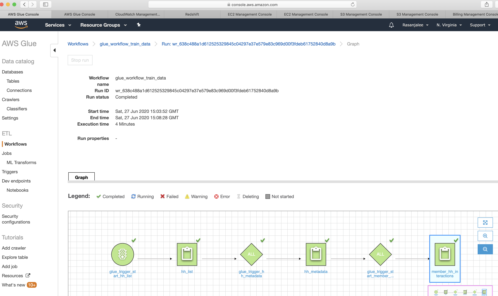

This will simulate a workflow that :

schemas: for ima redshift cluster tables

schema: create schema for genesis-postgres rds tables
    - job: get hh list  -->  job: get hh interactions
    - job: get journey interactions
    - job: Habits + Journeys interactions
    - job: get member journey interactions
    - job: get item(hh, journey) metadata

**Glue logging error:**+ https://forums.aws.amazon.com/thread.jspa?threadID=327300

# Create genesis rds database
in console > rds > postgres > free tier > user:testUser , pass:testPassword1 , publicly accessible

important:
`set the az to : us-east-1f` because you need to give this ib jdbc glue connection to rds and should match

if restoring rds from a snapshot, give same db id: genesis, select postgres-all sg and select az: us-east-1f

error if not:
https://docs.aws.amazon.com/glue/latest/dg/glue-troubleshooting-errors.html

troubleshoot fixes:
https://aws.amazon.com/premiumsupport/knowledge-center/glue-test-connection-failed/


glue_rds_connection failed. Availability Zone us-east-1c does not correspond to subnet .

Error: Could Not Find Subnet for AZ
The Availability Zone might not be available to AWS Glue. Create and use a new subnet in a different Availability Zone from the one specified in the message.

**Terraform**: connection to rds should not have port like redshift connection.

1. in dbvisualizer connect to db: (driver:PostgreSQL, Database server:Database Server	genesis.ckrirceczurq.us-east-1.rds.amazonaws.com, Port:5432, user: testUser, pass:testPassword1)
2. create tables:

```sql
CREATE TABLE public.action_activities (
	id bigserial NOT NULL,
	action_id int4 NULL,
	activity_type varchar(255) NOT NULL,
	manually_entered bool NULL DEFAULT false,
	CONSTRAINT pk_action_activities_id PRIMARY KEY (id)
);
INSERT INTO public.action_activities (action_id, activity_type, manually_entered) VALUES(1, 'Weight', true);
INSERT INTO public.action_activities (action_id, activity_type, manually_entered) VALUES(1, 'BioMetrics', false);

CREATE TABLE public."action" (
	id serial NOT NULL,
	"name" varchar(255) NOT NULL,
	description varchar(255) NOT NULL,
	action_type varchar(50) NOT NULL,
	CONSTRAINT pk_action PRIMARY KEY (id)
);
INSERT INTO public."action" ("name", description, action_type) VALUES('Weight', 'Weight', 'Weight');

CREATE TABLE public.tracker (
	id bigserial NOT NULL,
	description varchar(255) NOT NULL,
	title varchar(255) NOT NULL,
	thrive_category_id int8 NOT NULL,
	"action" int4 NULL,
	hide_on_healthy_habits bool NOT NULL DEFAULT false,
        status varchar(25) NOT NULL,
        sponsor_id int8 NULL,
	CONSTRAINT pk_tracker_id PRIMARY KEY (id),
	CONSTRAINT uq_tracker_action UNIQUE (action)
);
INSERT INTO public.tracker
(description, title, thrive_category_id, "action", hide_on_healthy_habits, status, sponsor_id)
VALUES('Daily Weight Tracker', 'What’s your Weight?', 1, 1, false, 'Published' , null);

CREATE TABLE public.thrive_category (
	id bigserial NOT NULL,
	"name" varchar(80) NULL,
	color varchar(20) NULL,
	order_index int8 NULL,
	"type" varchar(64) NULL,
	status varchar NOT NULL DEFAULT 'Unpublished'::character varying,
	"sensitive" bool NOT NULL DEFAULT false,
	CONSTRAINT pk_thrive_category PRIMARY KEY (id)
);
INSERT INTO public.thrive_category
("name", color, order_index, "type", status, "sensitive")
VALUES('Getting Active', '#f26700', 0, 'GettingActive', 'Published'::character varying, false);

```

veirfy creation:

```sql
SELECT 
    distinct aa.activity_type as activity_type
FROM action_activities aa
INNER JOIN action a  ON aa.action_id = a.id
INNER JOIN tracker t ON t.action = a.id
INNER JOIN thrive_category tc ON t.thrive_category_id = tc.id
WHERE t.hide_on_healthy_habits = 'false'
AND t.status = 'Published'
AND t.sponsor_id isNull
AND tc.status = 'Published'
AND aa.manually_entered != FALSE;
```

should output 'weight'

# Create Redshift cluster

do in console with user aws user and pass:testPassword1 with dc2.large i vpu, others defaults (see folder redshift-to-s3 for more info)

conncet to console query editor and create/populate tables:

```sql
create schema dw;

drop table  dw.dim_scd1_member
create table if not exists dw.dim_scd1_member
(
	member_key bigint not null encode delta32k
		constraint dim_scd1_member_pkey
			primary key,
	member_id bigint
)
diststyle all
sortkey(member_key);

INSERT INTO dw.dim_scd1_member(member_key, member_id) VALUES(2, 2);
INSERT INTO dw.dim_scd1_member(member_key, member_id) VALUES(1, 1);
INSERT INTO dw.dim_scd1_member(member_key, member_id) VALUES(3, 3);
INSERT INTO dw.dim_scd1_member(member_key, member_id) VALUES(4, 4);
INSERT INTO dw.dim_scd1_member(member_key, member_id) VALUES(5, 5);
INSERT INTO dw.dim_scd1_member(member_key, member_id) VALUES(6, 6);

create table if not exists dw.dim_scd1_tracker
(
	tracker_key bigint not null
		constraint dim_scd1_tracker_pkey
			primary key,
	tracker_id bigint not null,
	thrive_category_id BIGINT NOT NULL  ENCODE lzo,
	activity_type varchar(255) not null
)
diststyle all
sortkey(tracker_key);
delete from dw.dim_scd1_tracker;
INSERT INTO dw.dim_scd1_tracker (tracker_key, tracker_id, thrive_category_id, activity_type) VALUES(1,1,1, 'MovesSteps');
INSERT INTO dw.dim_scd1_tracker (tracker_key, tracker_id, thrive_category_id, activity_type) VALUES(2,2,6, 'TrainTheBrain');
INSERT INTO dw.dim_scd1_tracker (tracker_key, tracker_id, thrive_category_id, activity_type) VALUES(3,3,6, 'AreYouCurrent');
INSERT INTO dw.dim_scd1_tracker (tracker_key, tracker_id, thrive_category_id, activity_type) VALUES(4,4,2, 'StriivSleep');
INSERT INTO dw.dim_scd1_tracker (tracker_key, tracker_id, thrive_category_id, activity_type) VALUES(5,5,1, 'SamsungGearSteps');
INSERT INTO dw.dim_scd1_tracker (tracker_key, tracker_id, thrive_category_id, activity_type) VALUES(6,6,1, 'GarminSession');
INSERT INTO dw.dim_scd1_tracker (tracker_key, tracker_id, thrive_category_id, activity_type) VALUES(7,7,1, 'StravaSteps');
INSERT INTO dw.dim_scd1_tracker (tracker_key, tracker_id, thrive_category_id, activity_type) VALUES(8,8,3, 'Weight');
INSERT INTO dw.dim_scd1_tracker (tracker_key, tracker_id, thrive_category_id, activity_type) VALUES(9,9,8, 'Mood');
INSERT INTO dw.dim_scd1_tracker (tracker_key, tracker_id, thrive_category_id, activity_type) VALUES(10,10,3 'Yoga');

create table if not exists dw.fct_member_activity
(
	member_activity_key bigint not null encode zstd,
	member_key bigint not null encode zstd distkey,
	activity_type varchar(255) not null encode zstd,
	activity_date timestamp encode zstd,
	dw_created_date timestamp encode zstd
)
diststyle key
sortkey(member_key, activity_type);

delete from dw.fct_member_activity;
INSERT INTO dw.fct_member_activity (member_activity_key, member_key,  activity_type, activity_date, dw_created_date) VALUES(1,1, 'Weight', dateadd(year,-2, GETDATE()), dateadd(year,-2, GETDATE()));
INSERT INTO dw.fct_member_activity (member_activity_key, member_key,  activity_type, activity_date, dw_created_date) VALUES(2,1, 'TrainTheBrain', dateadd(month,-2, GETDATE()), dateadd(week,-2, GETDATE()));
INSERT INTO dw.fct_member_activity (member_activity_key, member_key,  activity_type, activity_date, dw_created_date) VALUES(3,1, 'Weight', dateadd(week,-1, GETDATE()), dateadd(week,-1, GETDATE()));
INSERT INTO dw.fct_member_activity (member_activity_key, member_key,  activity_type, activity_date, dw_created_date) VALUES(4,2, 'Weight', dateadd(week,-1, GETDATE()), dateadd(week,-1, GETDATE()));
INSERT INTO dw.fct_member_activity (member_activity_key, member_key,  activity_type, activity_date, dw_created_date) VALUES(5,2, 'TrainTheBrain', dateadd(week,-1, GETDATE()), dateadd(week,-1, GETDATE()));
INSERT INTO dw.fct_member_activity (member_activity_key, member_key,  activity_type, activity_date, dw_created_date) VALUES(6,2, 'Weight', dateadd(year,-1, GETDATE()), dateadd(year,-1, GETDATE()));

create table if not exists dw.dim_thrive_category
(
	thrive_category_key bigint not null encode zstd
		constraint dim_thrive_category_pkey
			primary key,
	thrive_category_id bigint not null encode zstd,
	name varchar(100) encode zstd
)
diststyle all
sortkey(thrive_category_key, thrive_category_id);

delete from dw.dim_thrive_category;
INSERT INTO dw.dim_thrive_category (thrive_category_key, thrive_category_id, "name") VALUES(1, 1, 'Getting Active');
INSERT INTO dw.dim_thrive_category (thrive_category_key, thrive_category_id, "name") VALUES(2, 2, 'Sleeping Well');
INSERT INTO dw.dim_thrive_category (thrive_category_key, thrive_category_id, "name") VALUES(3, 3, 'Eating Healthy');
INSERT INTO dw.dim_thrive_category (thrive_category_key, thrive_category_id, "name") VALUES(4, 4, 'Reducing Stress');
INSERT INTO dw.dim_thrive_category (thrive_category_key, thrive_category_id, "name") VALUES(5, 5, 'Being Productive');
INSERT INTO dw.dim_thrive_category (thrive_category_key, thrive_category_id, "name") VALUES(6, 6, 'Learning New Things');
INSERT INTO dw.dim_thrive_category (thrive_category_key, thrive_category_id, "name") VALUES(7, 7, 'Managing My Finances');
INSERT INTO dw.dim_thrive_category (thrive_category_key, thrive_category_id, "name") VALUES(8, 8, 'Building Relationships');
INSERT INTO dw.dim_thrive_category (thrive_category_key, thrive_category_id, "name") VALUES(9, 9, 'Contributing to My Community');
INSERT INTO dw.dim_thrive_category (thrive_category_key, thrive_category_id, "name") VALUES(10, 10, 'Embracing Diversity');

CREATE TABLE IF NOT EXISTS dw.dim_journey
(
	journey_key BIGINT NOT NULL  ENCODE zstd
	,journey_id BIGINT NOT NULL  ENCODE zstd
	, title  varchar(255) not null
	,PRIMARY KEY (journey_key)
)
DISTSTYLE ALL
 SORTKEY (
	journey_key
	, journey_id
	)
;

INSERT INTO dw.dim_journey (journey_key, journey_id, title) VALUES(1,1, 'Dont Stop Believin');
INSERT INTO dw.dim_journey (journey_key, journey_id, title) VALUES(2,2, 'Move to Lose');
INSERT INTO dw.dim_journey (journey_key, journey_id, title) VALUES(3,3, 'Smart Portions');
INSERT INTO dw.dim_journey (journey_key, journey_id, title) VALUES(4,4, 'Fit in More Fruit');
INSERT INTO dw.dim_journey (journey_key, journey_id, title) VALUES(5,5, 'Prepare to Quit');
         
CREATE TABLE IF NOT EXISTS dw.fct_member_journey_step
(
	member_journey_step_key BIGINT NOT NULL ENCODE zstd
	,member_key BIGINT NOT NULL  ENCODE zstd
	,journey_key BIGINT NOT NULL  ENCODE zstd
	,completed_date TIMESTAMP WITHOUT TIME ZONE   ENCODE zstd
	,dw_created_date TIMESTAMP WITHOUT TIME ZONE  DEFAULT getdate() ENCODE zstd
)
DISTSTYLE KEY
 DISTKEY (member_journey_step_key)
 SORTKEY (
	member_journey_step_key
	, member_key
	, journey_key
	)
;
INSERT INTO dw.fct_member_journey_step (member_journey_step_key, member_key, journey_key, completed_date, dw_created_date)VALUES(1, 1, 1, dateadd(week,-1, GETDATE()), dateadd(week,-1, GETDATE()));
INSERT INTO dw.fct_member_journey_step (member_journey_step_key, member_key, journey_key, completed_date, dw_created_date)VALUES(2, 2, 1, dateadd(week,-1, GETDATE()), dateadd(week,-1, GETDATE()));
INSERT INTO dw.fct_member_journey_step (member_journey_step_key, member_key, journey_key, completed_date, dw_created_date)VALUES(3, 3, 1, dateadd(week,-1, GETDATE()), dateadd(week,-1, GETDATE()));
INSERT INTO dw.fct_member_journey_step (member_journey_step_key, member_key, journey_key, completed_date, dw_created_date)VALUES(4, 1, 2, dateadd(week,-1, GETDATE()), dateadd(week,-1, GETDATE()));
INSERT INTO dw.fct_member_journey_step (member_journey_step_key, member_key, journey_key, completed_date, dw_created_date)VALUES(5, 2, 2, dateadd(week,-1, GETDATE()), dateadd(week,-1, GETDATE()));
INSERT INTO dw.fct_member_journey_step (member_journey_step_key, member_key, journey_key, completed_date, dw_created_date)VALUES(6, 3, 2, dateadd(week,-1, GETDATE()), dateadd(week,-1, GETDATE()));
INSERT INTO dw.fct_member_journey_step (member_journey_step_key, member_key, journey_key, completed_date, dw_created_date)VALUES(7, 4, 2, dateadd(week,-1, GETDATE()), dateadd(week,-1, GETDATE()));
INSERT INTO dw.fct_member_journey_step (member_journey_step_key, member_key, journey_key, completed_date, dw_created_date)VALUES(8, 5, 3, dateadd(week,-1, GETDATE()), dateadd(week,-1, GETDATE()));
```
workflow after creation:



# install pyspark locally:

`$ brew install apache-spark`

test:
`$ pyspark`

```sh
Welcome to
      ____              __
     / __/__  ___ _____/ /__
    _\ \/ _ \/ _ `/ __/  '_/
   /__ / .__/\_,_/_/ /_/\_\   version 3.0.0
      /_/

Using Python version 2.7.16 (default, Jan 27 2020 04:46:15)
SparkSession available as 'spark'.
>>>
```
# Bucket policies:

the dmrh-glue-scripts and dmrh-glue-output buckets need following policies respectively:

```json
{
    "Version": "2012-10-17",
    "Id": "GlueS3BucketAccessPolicy",
    "Statement": [
        {
            "Sid": "GlueS3BucketAccessPolicy",
            "Effect": "Allow",
            "Principal": {
                "Service": "glue.amazonaws.com"
            },
            "Action": [
                "s3:GetObject",
                "s3:ListBucket"
            ],
            "Resource": [
                "arn:aws:s3:::dmrh-glue-scripts",
                "arn:aws:s3:::dmrh-glue-scripts/*"
            ]
        }
    ]
}
```

```json
{
    "Version": "2012-10-17",
    "Id": "GlueS3BucketAccessPolicy",
    "Statement": [
        {
            "Sid": "GlueS3BucketAccessPolicy",
            "Effect": "Allow",
            "Principal": {
                "Service": "glue.amazonaws.com"
            },
            "Action": [
                "s3:GetObject",
                "s3:ListBucket"
            ],
            "Resource": [
                "arn:aws:s3:::dmrh-glue-output",
                "arn:aws:s3:::dmrh-glue-output/*"
            ]
        }
    ]
}
```

# security groups for databases to be used in glue

https://docs.aws.amazon.com/glue/latest/dg/setup-vpc-for-glue-access.html

## Setting Up a VPC to Connect to JDBC Data Stores

To enable AWS Glue components to communicate, you must set up access to your data stores, such as Amazon Redshift and Amazon RDS. To enable AWS Glue to communicate between its components, specify a security group with a `self-referencing inbound rule for all TCP ports`. By creating a self-referencing rule, you can restrict the source to the same security group in the VPC, and it's not open to all networks. The default security group for your VPC might already have a self-referencing inbound rule for ALL Traffic.

### To set up access for Amazon Redshift data stores

Sign in to the AWS Management Console and open the Amazon Redshift console at https://console.aws.amazon.com/redshift/.

In the left navigation pane, choose Clusters.

Choose the cluster name that you want to access from AWS Glue.

In the Cluster Properties section, choose a security group in VPC security groups to allow AWS Glue to use. Record the name of the security group that you chose for future reference. Choosing the security group opens the Amazon EC2 console Security Groups list.

Choose the security group to modify and navigate to the Inbound tab.

Add a self-referencing rule to allow AWS Glue components to communicate. Specifically, add or confirm that there is a rule of Type All TCP, Protocol is TCP, Port Range includes all ports, and whose Source is the same security group name as the Group ID.

The inbound rule looks similar to the following:

```sh
Type	Protocol	Port Range	Source
All TCP  TCP 		0–65535		database-security-group

```

Add a rule for outbound traffic also. `Either open outbound traffic to all ports`, for example:

Type			Protocol	Port Range	Destination
All Traffic		ALL			ALL			0.0.0.0/0

`Or create a self-referencing rule where Type All TCP, Protocol is TCP, Port Range includes all ports, and whose Destination is the same security group name as the Group ID`. `If using an Amazon S3 VPC endpoint, also add an HTTPS rule for Amazon S3 access`. The s3-prefix-list-id is required in the security group rule to allow traffic from the VPC to the Amazon S3 VPC endpoint.

For example:

Type		Protocol	Port Range	Destination
All TCP		TCP			0–65535		security-group

`HTTPS`		TCP			443			`s3-prefix-list-id`


### To set up access for Amazon RDS data stores

Sign in to the AWS Management Console and open the Amazon RDS console at https://console.aws.amazon.com/rds/.

In the left navigation pane, choose Instances.

Choose the Amazon RDS Engine and DB Instance name that you want to access from AWS Glue.

From Instance Actions, choose See Details. On the Details tab, find the Security Groups name you will access from AWS Glue. Record the name of the security group for future reference.

Choose the security group to open the Amazon EC2 console.

Confirm that your Group ID from Amazon RDS is chosen, then choose the Inbound tab.

`Add a self-referencing rule to allow AWS Glue components to communicate`. Specifically, add or confirm that there is a rule of Type All TCP, Protocol is TCP, Port Range includes all ports, and whose Source is the same security group name as the Group ID.

The inbound rule looks similar to this:

Type	Protocol	Port Range	Source
All TCP	TCP			0–65535		database-security-group

                    
Add a rule for outbound traffic also. Either open outbound traffic to all ports, for example:

Type			Protocol	Port Range	Destination
All Traffic		ALL			ALL			0.0.0.0/0

`Or create a self-referencing rule where Type All TCP, Protocol is TCP, Port Range includes all ports, and whose Destination is the same security group name as the Group ID`. 

`If using an Amazon S3 VPC endpoint, also add an HTTPS rule for Amazon S3 access`. The s3-prefix-list-id is required in the security group rule to allow traffic from the VPC to the Amazon S3 VPC endpoint.

For example:

Type		Protocol	Port Range	Destination
All TCP		TCP			0–65535		security-group
HTTPS		TCP			443			**s3-prefix-list-id**


# Different approaches to manually create Spark DataFrames

https://medium.com/@mrpowers/manually-creating-spark-dataframes-b14dae906393

## toDF()
toDF() provides a concise syntax for creating DataFrames and can be accessed after importing Spark implicits.
import spark.implicits._
The toDF() method can be called on a sequence object to create a DataFrame.

```python
val someDF = Seq(
  (8, "bat"),
  (64, "mouse"),
  (-27, "horse")
).toDF("number", "word")
```

someDF has the following schema.
```sh
root
 | — number: integer (nullable = false)
 | — word: string (nullable = true)

 ```

toDF() is limited because the column type and nullable flag cannot be customized. In this example, the number column is not nullable and the word column is nullable.
The import spark.implicits._ statement can only be run inside of class definitions when the Spark Session is available. All imports should be at the top of the file before the class definition, so toDF() encourages bad Scala coding practices.
toDF() is suitable for local testing, but production grade code that’s checked into master should use a better solution.

## createDataFrame()

The createDataFrame() method addresses the limitations of the toDF() method and allows for full schema customization and good Scala coding practices.
Here is how to create someDF with createDataFrame().

```python
val someData = Seq(
  Row(8, "bat"),
  Row(64, "mouse"),
  Row(-27, "horse")
)

val someSchema = List(
  StructField("number", IntegerType, true),
  StructField("word", StringType, true)
)

val someDF = spark.createDataFrame(
  spark.sparkContext.parallelize(someData),
  StructType(someSchema)
)
```

createDataFrame() provides the functionality we need, but the syntax is verbose. Our test files will become cluttered and difficult to read if createDataFrame() is used frequently.

## createDF()
createDF() is defined in spark-daria and allows for the following terse syntax.

```python
val someDF = spark.createDF(
  List(
    (8, "bat"),
    (64, "mouse"),
    (-27, "horse")
  ), List(
    ("number", IntegerType, true),
    ("word", StringType, true)
  )
)
```
createDF() creates readable code like toDF() and allows for full schema customization like createDataFrame(). It’s the best of both worlds.

Big shout out to Nithish for writing the advanced Scala code to make createDF() work so well.
Including spark-daria in your projects
The spark-daria README provides the following project setup instructions.
1. Add the sbt-spark-package plugin to your application. The spark-daria releases are maintained in Spark Packages.
2. Update your build.sbt file.
	`spDependencies += "mrpowers/spark-daria:0.5.0"`
3. Import the spark-daria code into your project:
	`import com.github.mrpowers.spark.daria.sql.SparkSessionExt._`


# Test glue script locally

here i simulate dataframes for each genesis rds tables and get hh list:

execute following in pyspark shell prompt >>> :

`unload-member-hh-interactions.py`:


```python

from pyspark.sql import functions as F

cols=[(1, 'Weight', 'Weight', 'Weight')]
df=spark.createDataFrame(cols,['id', 'name', 'description', 'action_type'])
genesis_action_df = df.select('id')
genesis_action_df = genesis_action_df.selectExpr("id as action_id")
genesis_action_df.show()
+---+
| id|
+---+
|  1|
+---+


cols = [(1, 'Weight', 'true'),(1, 'BioMetrics', 'false')]
df=spark.createDataFrame(cols,['action_id', 'activity_type', 'manually_entered'])
genesis_action_activities_df = df.filter(F.col("manually_entered") != False)
genesis_action_activities_df.show()
+---------+-------------+----------------+
|action_id|activity_type|manually_entered|
+---------+-------------+----------------+
|        1|       Weight|            true|
+---------+-------------+----------------+

cols=[(1, 'Getting Active', '#f26700', 0, 'GettingActive', 'Published', 'false')]
df=spark.createDataFrame(cols, ['id','name', 'color', 'order_index', 'type', 'status', 'sensitive'])
genesis_thrive_category_df = df.selectExpr("id as thrive_category_id", "status")
genesis_thrive_category_df.show()
+------------------+---------+
|thrive_category_id|   status|
+------------------+---------+
|                 1|Published|
+------------------+---------+

from pyspark.sql.types import StringType
df = sc.parallelize([(1,'Daily Weight Tracker', 'Whats your Weight?', 1, 1, 'false', 'Published', "null")]).toDF(['id', 'description', 'title', 'thrive_category_id', 'action', 'hide_on_healthy_habits', 'status', 'sponsor_id'])
new_column_udf = F.udf(lambda name: None if name == "null" else name, StringType())
genesis_tracker_df = df.withColumn("sponsor_id", new_column_udf(df.sponsor_id))
genesis_tracker_df = df
genesis_tracker_df = genesis_tracker_df.selectExpr("action as action_id","thrive_category_id", "hide_on_healthy_habits", "status", "sponsor_id")
genesis_tracker_df = genesis_tracker_df.filter(F.col("hide_on_healthy_habits") == False)
genesis_tracker_df = genesis_tracker_df.filter(F.col("status") == "Published")
genesis_tracker_df = genesis_tracker_df.filter(F.col("sponsor_id").isNull())
genesis_tracker_df.show()
+---+--------------------+------------------+------------------+------+----------------------+---------+----------+
| id|         description|             title|thrive_category_id|action|hide_on_healthy_habits|   status|sponsor_id|
+---+--------------------+------------------+------------------+------+----------------------+---------+----------+
|  1|Daily Weight Tracker|Whats your Weight?|                 1|     1|                 false|Published|      null|
+---+--------------------+------------------+------------------+------+----------------------+---------+----------+

genesis_action_activities_join_df = genesis_action_df.join(genesis_action_activities_df, 'action_id',how='inner')
genesis_action_activities_join_df.show()
+---------+-------------+----------------+
|action_id|activity_type|manually_entered|
+---------+-------------+----------------+
|        1|       Weight|            true|
+---------+-------------+----------------+

tracker_action_activities_join_df = genesis_action_activities_join_df.join(genesis_tracker_df, 'action_id',how='inner')
tracker_action_activities_join_df.show()
+---------+-------------+----------------+------------------+----------------------+---------+----------+
|action_id|activity_type|manually_entered|thrive_category_id|hide_on_healthy_habits|   status|sponsor_id|
+---------+-------------+----------------+------------------+----------------------+---------+----------+
|        1|       Weight|            true|                 1|                 false|Published|      null|
+---------+-------------+----------------+------------------+----------------------+---------+----------+

thrirvecategory_tracker_action_activities_join_df = tracker_action_activities_join_df.join(genesis_thrive_category_df, 'thrive_category_id',how='inner')
thrirvecategory_tracker_action_activities_join_df.show()
+------------------+---------+-------------+----------------+----------------------+---------+----------+---------+
|thrive_category_id|action_id|activity_type|manually_entered|hide_on_healthy_habits|   status|sponsor_id|   status|
+------------------+---------+-------------+----------------+----------------------+---------+----------+---------+
|                 1|        1|       Weight|            true|                 false|Published|      null|Published|
+------------------+---------+-------------+----------------+----------------------+---------+----------+---------+

hh_list_df = thrirvecategory_tracker_action_activities_join_df.select('activity_type').distinct()
hh_list_df.show()
+-------------+
|activity_type|
+-------------+
|       Weight|
+-------------+
```

ima_ tables pyspark:


```python
cols=[(1,1), (2,2), (3,3), (4,4) , (5,5), (6,6)]
ima_member_df=spark.createDataFrame(cols,['member_key', 'member_id'])
ima_member_df = ima_member_df.filter(F.col("member_id").isNotNull())
ima_member_df = ima_member_df.select("member_id","member_key")
ima_member_df.show()
+---------+----------+
|member_id|member_key|
+---------+----------+
|        1|         1|
|        2|         2|
|        3|         3|
|        4|         4|
|        5|         5|
|        6|         6|
+---------+----------+


cols = [(1,1, 'Weight', datetime.datetime(2020, 6, 29, 11, 34, 29), datetime.datetime(2020, 6, 29, 11, 34, 29)), (2,1, 'TrainTheBrain', datetime.datetime(2019, 12, 29, 11, 34, 29), datetime.datetime(2019, 12, 29, 11, 34, 29)), (3,1, 'Weight', datetime.datetime(2020, 5, 29, 11, 34, 29), datetime.datetime(2020, 5, 29, 11, 34, 29)), (4,2, 'Weight', datetime.datetime(2020, 4, 29, 11, 34, 29), datetime.datetime(2020, 4, 29, 11, 34, 29)), (5,2, 'TrainTheBrain', datetime.datetime(2020, 4, 29, 11, 34, 29), datetime.datetime(2020, 4, 29, 11, 34, 29)), (6,2, 'Weight', datetime.datetime(2020, 4, 29, 11, 34, 29), datetime.datetime(2020, 4, 29, 11, 34, 29)), (7,2, 'Weight', datetime.datetime(2013, 6, 29, 11, 34, 29), datetime.datetime(2013, 6, 29, 11, 34, 29))]

ima_member_activity_df = spark.createDataFrame(cols,['member_activity_key', 'member_key',  'activity_type', 'activity_date', 'dw_created_date'])

ima_member_activity_df.show()
+-------------------+----------+-------------+-------------------+-------------------+
|member_activity_key|member_key|activity_type|      activity_date|    dw_created_date|
+-------------------+----------+-------------+-------------------+-------------------+
|                  1|         1|       Weight|2020-06-29 11:34:29|2020-06-29 11:34:29|
|                  2|         1|TrainTheBrain|2019-12-29 11:34:29|2019-12-29 11:34:29|
|                  3|         1|       Weight|2020-05-29 11:34:29|2020-05-29 11:34:29|
|                  4|         2|       Weight|2020-04-29 11:34:29|2020-04-29 11:34:29|
|                  5|         2|TrainTheBrain|2020-04-29 11:34:29|2020-04-29 11:34:29|
|                  6|         2|       Weight|2020-04-29 11:34:29|2020-04-29 11:34:29|
|                  7|         2|       Weight|2013-06-29 11:34:29|2013-06-29 11:34:29|
+-------------------+----------+-------------+-------------------+-------------------+

ima_member_activity_df = ima_member_activity_df.join(hh_list_df, 'activity_type',how='inner')
ima_member_activity_df.show()
+-------------+-------------------+----------+-------------------+-------------------+
|activity_type|member_activity_key|member_key|      activity_date|    dw_created_date|
+-------------+-------------------+----------+-------------------+-------------------+
|       Weight|                  1|         1|2020-06-29 11:34:29|2020-06-29 11:34:29|
|       Weight|                  3|         1|2020-05-29 11:34:29|2020-05-29 11:34:29|
|       Weight|                  4|         2|2020-04-29 11:34:29|2020-04-29 11:34:29|
|       Weight|                  6|         2|2020-04-29 11:34:29|2020-04-29 11:34:29|
|       Weight|                  7|         2|2013-06-29 11:34:29|2013-06-29 11:34:29|
+-------------+-------------------+----------+-------------------+-------------------+

ima_member_activity_df = ima_member_activity_df.select("activity_date","dw_created_date", "member_key", "activity_type")
ima_member_activity_df.show()
+-------------------+-------------------+----------+-------------+
|      activity_date|    dw_created_date|member_key|activity_type|
+-------------------+-------------------+----------+-------------+
|2020-06-29 11:34:29|2020-06-29 11:34:29|         1|       Weight|
|2020-05-29 11:34:29|2020-05-29 11:34:29|         1|       Weight|
|2020-04-29 11:34:29|2020-04-29 11:34:29|         2|       Weight|
|2020-04-29 11:34:29|2020-04-29 11:34:29|         2|       Weight|
|2013-06-29 11:34:29|2013-06-29 11:34:29|         2|       Weight|
+-------------------+-------------------+----------+-------------+

ima_member_activity_df = ima_member_activity_df.filter(F.col("activity_date") >= F.add_months(F.current_date(), -12))
ima_member_activity_df.show()
+-------------------+-------------------+----------+-------------+
|      activity_date|    dw_created_date|member_key|activity_type|
+-------------------+-------------------+----------+-------------+
|2020-06-29 11:34:29|2020-06-29 11:34:29|         1|       Weight|
|2020-05-29 11:34:29|2020-05-29 11:34:29|         1|       Weight|
|2020-04-29 11:34:29|2020-04-29 11:34:29|         2|       Weight|
|2020-04-29 11:34:29|2020-04-29 11:34:29|         2|       Weight|
+-------------------+-------------------+----------+-------------+

cols = [(1,1, 'MovesSteps'), (2,2, 'TrainTheBrain'), (3,3, 'AreYouCurrent'), (4,4, 'StriivSleep'), (5,5, 'SamsungGearSteps'), (6,6, 'GarminSession'), (7,7, 'StravaSteps'), (8,8, 'Weight'), (9,9, 'Mood'), (10,10, 'Yoga')]
ima_tracker_df = spark.createDataFrame(cols,['tracker_key', 'tracker_id', 'activity_type'])
ima_tracker_df = ima_tracker_df.select("tracker_id","activity_type")
ima_tracker_df.show()
+----------+----------------+
|tracker_id|   activity_type|
+----------+----------------+
|         1|      MovesSteps|
|         2|   TrainTheBrain|
|         3|   AreYouCurrent|
|         4|     StriivSleep|
|         5|SamsungGearSteps|
|         6|   GarminSession|
|         7|     StravaSteps|
|         8|          Weight|
|         9|            Mood|
|        10|            Yoga|
+----------+----------------+

ima_member_activity_join_df = ima_member_df.join(ima_member_activity_df, 'member_key',how='left')
ima_member_activity_join_df.show()
+----------+---------+-------------------+-------------------+-------------+
|member_key|member_id|      activity_date|    dw_created_date|activity_type|
+----------+---------+-------------------+-------------------+-------------+
|         6|        6|               null|               null|         null|
|         5|        5|               null|               null|         null|
|         1|        1|2020-06-29 11:34:29|2020-06-29 11:34:29|       Weight|
|         1|        1|2020-05-29 11:34:29|2020-05-29 11:34:29|       Weight|
|         3|        3|               null|               null|         null|
|         2|        2|2020-04-29 11:34:29|2020-04-29 11:34:29|       Weight|
|         2|        2|2020-04-29 11:34:29|2020-04-29 11:34:29|       Weight|
|         4|        4|               null|               null|         null|
+----------+---------+-------------------+-------------------+-------------+

ima_tracker_member_activity_join_df = ima_member_activity_join_df.join(ima_tracker_df, 'activity_type',how='inner')
ima_tracker_member_activity_join_df.show()
+-------------+----------+---------+-------------------+-------------------+----------+
|activity_type|member_key|member_id|      activity_date|    dw_created_date|tracker_id|
+-------------+----------+---------+-------------------+-------------------+----------+
|       Weight|         1|        1|2020-06-29 11:34:29|2020-06-29 11:34:29|         8|
|       Weight|         1|        1|2020-05-29 11:34:29|2020-05-29 11:34:29|         8|
|       Weight|         2|        2|2020-04-29 11:34:29|2020-04-29 11:34:29|         8|
|       Weight|         2|        2|2020-04-29 11:34:29|2020-04-29 11:34:29|         8|
+-------------+----------+---------+-------------------+-------------------+----------+

https://stackoverflow.com/questions/46122846/pyspark-inconsistency-in-converting-timestamp-to-integer-in-dataframe

import datetime
import time

ima_tracker_member_activity_join_df.select(F.unix_timestamp(F.col('activity_date'), format='yyyy-MM-dd HH:mm:ss')).show()
+--------------------------------------------------+
|unix_timestamp(activity_date, yyyy-MM-dd HH:mm:ss)|
+--------------------------------------------------+
|                                        1593448469|
|                                        1590770069|
|                                        1588178069|
|                                        1588178069|
+--------------------------------------------------+

ima_tracker_member_activity_join_df = ima_tracker_member_activity_join_df.withColumn("TIMESTAMP",when(F.col("activity_date").isNotNull(), F.unix_timestamp(F.col('activity_date'), format='yyyy-MM-dd HH:mm:ss')).otherwise(F.unix_timestamp(F.col('dw_created_date'), format='yyyy-MM-dd HH:mm:ss'))).show()
+-------------+----------+---------+-------------------+-------------------+----------+----------+
|activity_type|member_key|member_id|      activity_date|    dw_created_date|tracker_id| TIMESTAMP|
+-------------+----------+---------+-------------------+-------------------+----------+----------+
|       Weight|         1|        1|2020-06-29 11:34:29|2020-06-29 11:34:29|         8|1593448469|
|       Weight|         1|        1|2020-05-29 11:34:29|2020-05-29 11:34:29|         8|1590770069|
|       Weight|         2|        2|2020-04-29 11:34:29|2020-04-29 11:34:29|         8|1588178069|
|       Weight|         2|        2|2020-04-29 11:34:29|2020-04-29 11:34:29|         8|1588178069|
+-------------+----------+---------+-------------------+-------------------+----------+----------+

ima_tracker_member_activity_join_df = ima_tracker_member_activity_join_df.withColumn("ITEM_ID", F.concat(F.lit("hh_"),F.col("tracker_id")))
ima_tracker_member_activity_join_df.show()
+-------------+----------+---------+-------------------+-------------------+----------+----------+-------+
|activity_type|member_key|member_id|      activity_date|    dw_created_date|tracker_id| TIMESTAMP|ITEM_ID|
+-------------+----------+---------+-------------------+-------------------+----------+----------+-------+
|       Weight|         1|        1|2020-06-29 11:34:29|2020-06-29 11:34:29|         8|1593448469|   hh_8|
|       Weight|         1|        1|2020-05-29 11:34:29|2020-05-29 11:34:29|         8|1590770069|   hh_8|
|       Weight|         2|        2|2020-04-29 11:34:29|2020-04-29 11:34:29|         8|1588178069|   hh_8|
|       Weight|         2|        2|2020-04-29 11:34:29|2020-04-29 11:34:29|         8|1588178069|   hh_8|
+-------------+----------+---------+-------------------+-------------------+----------+----------+-------+

```

`unload-item-metadata.py`

```python

from pyspark.sql import functions as F
from pyspark.sql.functions import trim
from pyspark.sql import functions as F
from pyspark.sql.functions import concat, col, lit
from pyspark.sql.functions import when
from pyspark.sql.types import *

cols = [(1,1,1, 'MovesSteps'), (2,2,6, 'TrainTheBrain'), (3,3,6, 'AreYouCurrent'), (4,4,2, 'StriivSleep'), (5,5,1, 'SamsungGearSteps'), (6,6,1, 'GarminSession'), (7,7,1, 'StravaSteps'), (8,8,3, 'Weight'), (9,9,8, 'Mood'), (10,10,3, 'Yoga')]
ima_tracker_df = spark.createDataFrame(cols,['tracker_key', 'tracker_id', 'thrive_category_id', 'activity_type'])
ima_tracker_df = ima_tracker_df.select("tracker_id","thrive_category_id","activity_type")
ima_tracker_df = ima_tracker_df.join(hh_list_df, 'activity_type',how='inner')
ima_tracker_df.show()
+-------------+----------+------------------+
|activity_type|tracker_id|thrive_category_id|
+-------------+----------+------------------+
|       Weight|         8|                 3|
+-------------+----------+------------------+

cols = [(1, 1, 'Getting Active'), (2, 2, 'Sleeping Well'), (3, 3, 'Eating Healthy'), (4, 4, 'Reducing Stress'), (5, 5, 'Being Productive'), (6, 6, 'Learning New Things'), (7, 7, 'Managing My Finances'), (8, 8, 'Building Relationships'), (9, 9, 'Contributing to My Community'), (10, 10, 'Embracing Diversity')]
ima_thrive_category_df = spark.createDataFrame(cols,['thrive_category_key', 'thrive_category_id', 'name'])
ima_thrive_category_df = ima_thrive_category_df.select("thrive_category_id")
ima_thrive_category_df.show()

+------------------+
|thrive_category_id|
+------------------+
|                 1|
|                 2|
|                 3|
|                 4|
|                 5|
|                 6| 
|                 7|
|                 8|
|                 9|
|                10|
+------------------+

#INNER JOIN dw.dim_thrive_category dtc ON dst.thrive_category_id = dtc.thrive_category_id
ima_tracker_thrive_category_join_df = ima_tracker_df.join(ima_thrive_category_df, 'thrive_category_id',how='inner')
ima_tracker_thrive_category_join_df.show()
+------------------+-------------+----------+
|thrive_category_id|activity_type|tracker_id|
+------------------+-------------+----------+
|                 3|       Weight|         8|
+------------------+-------------+----------+

ima_tracker_thrive_category_join_df = ima_tracker_thrive_category_join_df.distinct()
ima_tracker_thrive_category_join_df.show()
+------------------+-------------+----------+
|thrive_category_id|activity_type|tracker_id|
+------------------+-------------+----------+
|                 3|       Weight|         8|
+------------------+-------------+----------+

ima_tracker_thrive_category_join_df = ima_tracker_thrive_category_join_df.withColumn("ITEM_ID", F.concat(F.lit("hh_"),F.col("tracker_id")))
ima_tracker_thrive_category_join_df.show()
+------------------+-------------+----------+-------+
|thrive_category_id|activity_type|tracker_id|ITEM_ID|
+------------------+-------------+----------+-------+
|                 3|       Weight|         8|   hh_8|
+------------------+-------------+----------+-------+

ima_tracker_thrive_category_join_df = ima_tracker_thrive_category_join_df.withColumn("ITEM_TYPE", F.lit("hh_"))
ima_tracker_thrive_category_join_df.show()
+------------------+-------------+----------+-------+---------+
|thrive_category_id|activity_type|tracker_id|ITEM_ID|ITEM_TYPE|
+------------------+-------------+----------+-------+---------+
|                 3|       Weight|         8|   hh_8|      hh_|
+------------------+-------------+----------+-------+---------+

ima_tracker_thrive_category_join_df = ima_tracker_thrive_category_join_df.selectExpr("ITEM_ID","ITEM_TYPE","thrive_category_id")
ima_tracker_thrive_category_join_df.show()
+-------+---------+------------------+
|ITEM_ID|ITEM_TYPE|thrive_category_id|
+-------+---------+------------------+
|   hh_8|      hh_|                 3|
+-------+---------+------------------+


```

# Read input parameters:

https://stackoverflow.com/questions/52316668/aws-glue-job-input-parameters

these can be set under default args in tf and read in python scripts

# Right/Left joins

Currently, LEFT and RIGHT joins are not supported by AWS Glue. 

But, we can still achieve it by converting the DynamicFrame to the DataFrame and using join method.

```python
cUser0 = glueContext.create_dynamic_frame.from_catalog(database = "captains", table_name = "cp_txn_winds_karyakarta_users", transformation_ctx = "cUser")
cUser0DF = cUser0.toDF() #spark data frame 1

cKKR = glueContext.create_dynamic_frame.from_catalog(database = "captains", table_name = "cp_txn_winds_karyakarta_karyakartas", redshift_tmp_dir = args["TempDir"], transformation_ctx = "cKKR")
cKKRDF = cKKR.toDF() #spark dataframe 2

#left join
joinedDF = cUser0DF.join(cKKRDF, cUser0DF.id == cKKRDF.user_id,how='left_outer')

#convert back to glue dynamic frame
DynamicFrame.fromDF(joinedDF, glueContext, "joinedDF")
```
## isin list

https://stackoverflow.com/questions/55046432/pyspark-filtering-with-isin-returns-empty-dataframe

The expression df.id.isin(unique_ids.id) == False is evaluating if Column<b'((id IN (id)) = false)'> and this will never happen because id is in id. However, the expression df.id.isin(unique_ids.id) is evaluating if Column<b'(id IN (id))'>, and this is always true, for that reason it returns the whole data frame. unique_ids.id is a Column not a list.

isin(*cols) receives a list of values as an argument, not a column, so, to work in this way, you should execute the following:

ids = unique_ids.rdd.map(lambda x:x.id).collect()
df[df.id.isin(ids)].collect() # or show...
and you will obtain:

[Row(id=2, value=54), Row(id=4, value=13), Row(id=5, value=78)]
In any case, I think it would be better if you join both data frames:

df_ = df.join(unique_ids, on='id')
getting:

df_.show()
+---+-----+-----+
| id|value|count|
+---+-----+-----+
|  5|   78|    1|
|  2|   54|    1|
|  4|   13|    1|
+---+-----+-----+
share  improve this answe


# Merge dynamic frames

merged_frame = source_frame.mergeDynamicFrame(stage_frame, ["id"]) 

should be useful for `job: Habits + Journeys interactions`

# Case statement:
https://stackoverflow.com/questions/39982135/apache-spark-dealing-with-case-statements

These are few ways to write If-Else / When-Then-Else / When-Otherwise expression in pyspark.

Sample dataframe

df = spark.createDataFrame([(1,1),(2,2),(3,3)],['id','value'])

df.show()

#+---+-----+
#| id|value|
#+---+-----+
#|  1|    1|
#|  2|    2|
#|  3|    3|
#+---+-----+

#Desired Output:
#+---+-----+----------+
#| id|value|value_desc|
#+---+-----+----------+
#|  1|    1|       one|
#|  2|    2|       two|
#|  3|    3|     other|
#+---+-----+----------+

Option#1: withColumn() using when-otherwise

from pyspark.sql.functions import when
`df.withColumn("value_desc",when(df.value == 1, 'one').when(df.value == 2, 'two').otherwise('other')).show()`

Option#2: select() using when-otherwise

from pyspark.sql.functions import when

`df.select("*",when(df.value == 1, 'one').when(df.value == 2, 'two').otherwise('other').alias('value_desc')).show()`

Option3: selectExpr() using SQL equivalent CASE expression

`df.selectExpr("*","CASE WHEN value == 1 THEN  'one' WHEN value == 2 THEN  'two' ELSE 'other' END AS value_desc").show()`

SQL like expression can also be written in withColumn() and select() using pyspark.sql.functions.expr function. Here are examples.

Option4: select() using expr function

from pyspark.sql.functions import expr 

`df.select("*",expr("CASE WHEN value == 1 THEN  'one' WHEN value == 2 THEN  'two' ELSE 'other' END AS value_desc")).show()`

Option5: withColumn() using expr function

from pyspark.sql.functions import expr 

`df.withColumn("value_desc",expr("CASE WHEN value == 1 THEN  'one' WHEN value == 2 THEN  'two' ELSE 'other' END AS value_desc")).show()`

Output:

#+---+-----+----------+
#| id|value|value_desc|
#+---+-----+----------+
#|  1|    1|       one|
#|  2|    2|       two|
#|  3|    3|     other|
#+---+-----+----------+


# Rename a file

https://stackoverflow.com/questions/34077353/how-to-change-dataframe-column-names-in-pyspark


# Rename glue output file

re-partition to 1 in dynamic frame to write to s3

```python
datasink = final_df.toDF()
datasink.write.format("csv").option("header", "true").mode("overwrite").save("s3://dmrh-glue-output/genesis-data/genesis_hh")
```

also rename csv generated:

# Allow iam users s3 bucket policy

```terraform
resource "aws_s3_bucket_policy" "bucket_policy" {
  bucket = "${aws_s3_bucket.bucket.id}"

  policy = <<EOF
{
  "Version": "2012-10-17",
  "Statement": [
    {
      "Effect": "Allow",
      "Principal": {
        "AWS": "${aws_iam_user.user.arn}"
      },
      "Action": [ "s3:*" ],
      "Resource": [
        "${aws_s3_bucket.bucket.arn}",
        "${aws_s3_bucket.bucket.arn}/*"
      ]
    }
  ]
}
EOF
}
```

https://ujjwalbhardwaj.me/post/rename-aws-glue-job-output-file


# Terraform examples

 https://github.com/MitocGroup/terraform-aws-glue-crawler

https://github.com/SebastianUA/terraform-aws-glue


