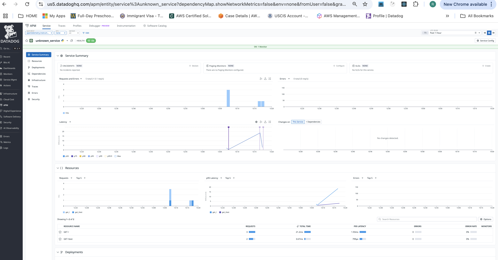

[grok thread:](https://grok.com/c/63f17fc5-adf2-4090-8f9c-da1c1e77450a)
https://www.reddit.com/r/OpenTelemetry/comments/1cjwh6w/opentelemetry_python_manual_tracing_tutorial/


### Step 1: Install Required Packages


To create a Conda environment for a Flask application with OpenTelemetry, you need to define the required packages in a .yml file and then use the Conda command-line interface to create the environment. 

**Create the environment.yml file**
`mac-otel-flask.yml` :
```yml
name: flask-dd-otel
channels:
  - conda-forge
  - defaults
dependencies:
  - python=3.12
  - pip
  - pip:
      - flask==3.0.3
      - opentelemetry-api==1.27.0
      - opentelemetry-sdk==1.27.0
      - opentelemetry-exporter-otlp-proto-grpc==1.27.0
      - opentelemetry-instrumentation-flask==0.48b0
      - opentelemetry-instrumentation==0.48b0
      - importlib_metadata==8.4.0
```

**run:**
```sh
conda env create -f mac-otel-flask.yml
```

OR:
Open your terminal and run:
```
pip install flask opentelemetry-api opentelemetry-sdk opentelemetry-instrumentation-flask opentelemetry-exporter-console
```

- `flask`: Already needed for the app (reinstall if necessary).
- `opentelemetry-api` and `opentelemetry-sdk`: Core oTel libraries.
- `opentelemetry-instrumentation-flask`: Auto-instruments Flask apps for tracing.
- `opentelemetry-exporter-console`: Exports traces to the console (for testing).


For updates to file:
```sh
conda env update -f setup-datadog-otel.yml --prune
```

### Step 2: Create basic OTEL instrumented app.py

app.py:
```py
from flask import Flask
from opentelemetry import trace
from opentelemetry.exporter.otlp.proto.grpc.trace_exporter import OTLPSpanExporter
from opentelemetry.sdk.resources import Resource
from opentelemetry.sdk.trace import TracerProvider
from opentelemetry.sdk.trace.export import BatchSpanProcessor
from opentelemetry.instrumentation.flask import FlaskInstrumentor
import os

# Configure OpenTelemetry with resource attributes
resource = Resource(
    attributes={
        "service.name": "flask-dd-otel-app",  # Custom service name for Datadog
        "service.version": "1.0.0",           # Optional
        "deployment.environment": "development"  # Optional
    }
)

# Set up tracer provider
trace.set_tracer_provider(TracerProvider(resource=resource))
tracer_provider = trace.get_tracer_provider()
tracer_provider.add_span_processor(
    BatchSpanProcessor(
        OTLPSpanExporter(endpoint="http://localhost:4317")  # Datadog Agent OTLP endpoint
    )
)

# Initialize Flask app
app = Flask(__name__)
FlaskInstrumentor.instrument_app(app)

# Example route
@app.route('/')
def hello():
    tracer = trace.get_tracer(__name__)
    with tracer.start_as_current_span("example-span"):
        return 'Hello, World! Datadog OTEL Tracing'

# Additional route for testing
@app.route('/test')
def test():
    tracer = trace.get_tracer(__name__)
    with tracer.start_as_current_span("test-span"):
        return 'Test Route for Tracing'

if __name__ == '__main__':
    app.run(host='0.0.0.0', port=5001, debug=True)
```

test with `python3 app.py`:

output:
```sh
WARNING: This is a development server. Do not use it in a production deployment. Use a production WSGI server instead.
 * Running on all addresses (0.0.0.0)
 * Running on http://127.0.0.1:5001
 * Running on http://192.168.0.10:5001
Press CTRL+C to quit
```

if you get in app.py output warning:
```sh
/opt/miniconda3/envs/flask-dd-otel/lib/python3.12/site-packages/opentelemetry/instrumentation/dependencies.py:4: UserWarning: pkg_resources is deprecated as an API. See https://setuptools.pypa.io/en/latest/pkg_resources.html. The pkg_resources package is slated for removal as early as 2025-11-30. Refrain from using this package or pin to Setuptools<81.
  from pkg_resources import (
 * Serving Flask app 'app'
 * Debug mode: on
```
run to temporarily supress:
`export PYTHONWARNINGS="ignore::UserWarning:opentelemetry.instrumentation.dependencies"`


**Create .env in the project root**:
```sh
OTEL_SERVICE_NAME=my-flask-app
OTEL_EXPORTER_OTLP_ENDPOINT=http://host.docker.internal:4317
DD_OTLP_CONFIG_RECEIVER_PROTOCOLS_HTTP_ENDPOINT=http://host.docker.internal:4318
OTEL_EXPORTER_OTLP_PROTOCOL=grpc
OTEL_RESOURCE_ATTRIBUTES=service.version=1.0.0
OTEL_PYTHON_LOGGING_AUTO_INSTRUMENTATION_ENABLED=true
DD_API_KEY=your-api-key
DD_SITE="us5.datadoghq.com"
DD_AGENT_MAJOR_VERSION=7
```

**Run the app with auto-instrumentation:**
```sh
source .env  # Or export vars individually
```

### Step 4: Set Up Datadog Agent with Docker Compose

The Agent receives OTLP data and forwards it to Datadog.

Create `docker-compose.yml` in the project root:
```yml
version: '3.8'
services:
  datadog-agent:
    image: gcr.io/datadoghq/agent:latest
    container_name: datadog-agent
    restart: always
    environment:
      - DD_API_KEY=${DD_API_KEY}  # Set this in .env or export
      - DD_SITE=datadoghq.com     # Or your region, e.g., datadoghq.eu
      - DD_OTLP_CONFIG_RECEIVER_PROTOCOLS_GRPC_ENABLED=true
      - DD_OTLP_CONFIG_RECEIVER_PROTOCOLS_GRPC_ENDPOINT=0.0.0.0:4317
      - DD_LOGS_ENABLED=true
      - DD_APM_ENABLED=true
      - DD_CONTAINER_EXCLUDE="name:datadog-agent"
    ports:
      - "8126:8126/udp"  # For direct ddtrace if needed
      - "4317:4317"      # OTLP gRPC
      - "4318:4318"      # OTLP HTTP (optional)
    volumes:
      - /var/run/docker.sock:/var/run/docker.sock:ro  # For container metrics
      - /proc/:/host/proc/:ro
      - /sys/fs/cgroup/:/host/sys/fs/cgroup:ro
```

**Create your DD_API_KEY**:

- Log in to your Datadog account (e.g., at app.datadoghq.com for the US region or app.datadoghq.eu for the EU region).
- Navigate to Organization Settings > API Keys (usually under your user profile or Integrations).
- Create a new API key or copy an existing one. It’s a 32-character alphanumeric string, e.g., a1b2c3d4e5f6g7h8i9j0k1l2m3n4o5p6.
- Do not share this key publicly—it’s sensitive and grants access to your Datadog account.

**Add your DD_API_KEY to .env (or export):**
```sh
DD_API_KEY=your_datadog_api_key_here
```

resource:
```sh
source .env
```

### Step 3: Configure Datadog OpenTelemetry(otel) for OTLP export. 

**install otel instegration in your https://us5.datadoghq.com/integrations/otel **
- search in the website with keyword : otel
- click on `otel integrtion`
- click `install`


**Start the Agent:**
```sh
$ docker compose up -d datadog-agent

#verify
$ docker ps 
CONTAINER ID   IMAGE                  COMMAND                CREATED          STATUS                    PORTS                                                                          NAMES
8fb2cdd1e2a6   datadog/agent:7.56.0   "/bin/entrypoint.sh"   57 seconds ago   Up 55 seconds (healthy)   0.0.0.0:4317-4318->4317-4318/tcp, 8125/udp, 8126/tcp, 0.0.0.0:8126->8126/udp   datadog-agent
```

check for logs:
```sh
docker logs datadog-agent -f
```

### Step 5: Connect and test:
- Ensure the Flask app's OTEL_EXPORTER_OTLP_ENDPOINT points to http://host.docker.internal:4317 (resolves to host's Docker from container).
- On Linux, use your host IP (e.g., http://192.168.1.x:4317) instead.
- Run the Flask app (as in Step 1). Hit http://localhost:5001 http://localhost:5001/test and  multiple times.

Python console output:
```sh
127.0.0.1 - - [02/Oct/2025 13:07:16] "GET / HTTP/1.1" 200 -
127.0.0.1 - - [02/Oct/2025 13:07:54] "GET /test HTTP/1.1" 200 -
```

docker-compose output:
```sh
2025-10-02 18:16:44 UTC | CORE | INFO | (exporter@v0.104.0/internal/common/logging_exporter.go:31 in pushTraces) | kind:exporter,data_type:traces,name:logging,resource spans:1,spans:2 | TracesExporter

2025-10-02 18:17:29 UTC | TRACE | INFO | (pkg/trace/info/stats.go:91 in LogAndResetStats) | No data received
2025-10-02 18:17:34 UTC | CORE | INFO | (exporter@v0.104.0/internal/common/logging_exporter.go:31 in pushTraces) | kind:exporter,data_type:traces,name:logging,resource spans:1,spans:2 | TracesExporter
```


- In Datadog:
    - Go to APM > Traces Explorer. Search for service:my-flask-app.
    - You should see spans for Flask requests (e.g., route /, response time).
    - If no data: Check Agent logs for OTLP ingestion; ensure firewall allows port 4317.

https://us5.datadoghq.com/apm/home output (select environment: development as set by app.py):



