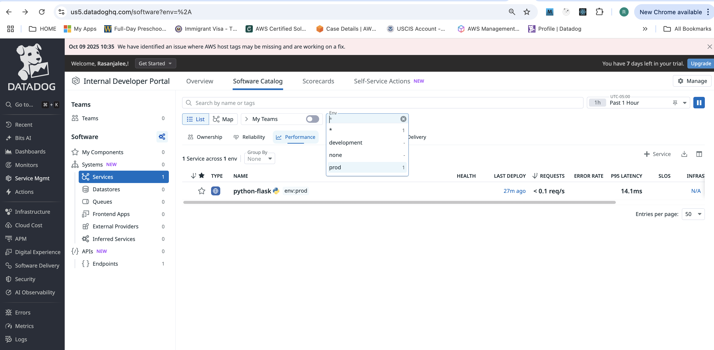
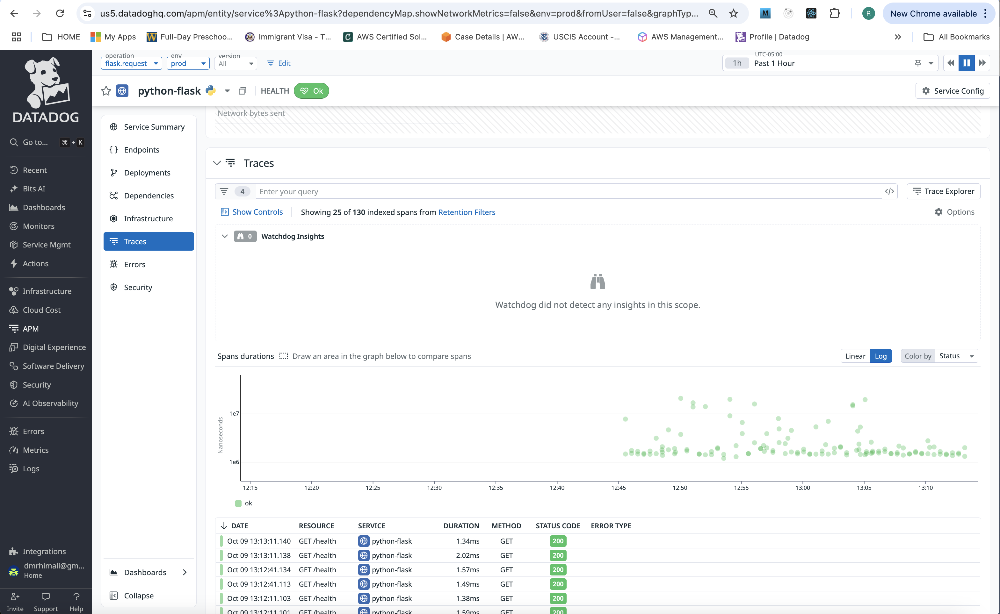
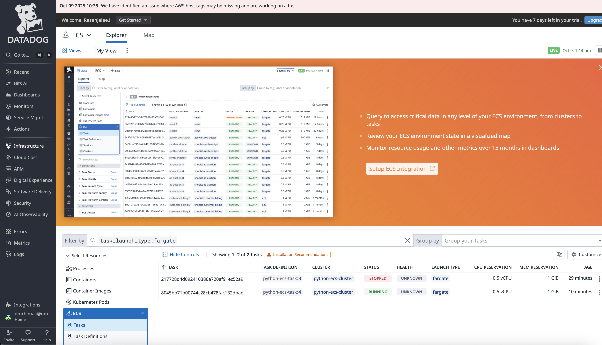

https://docs.datadoghq.com/integrations/aws-fargate/?tab=terraform

https://grok.com/c/a7bbc992-717c-4218-8b43-f7757e3f0609

### Create Datadog API key 
create Datadog API key at:
https://us5.datadoghq.com/organization-settings/api-keys
copy

### Create Datadog App key 
create Datadog App key at:
https://us5.datadoghq.com/organization-settings/application-keys
copy

### Step-by-Step Guide: Deploying a Python Container to ECS Fargate with Datadog Instrumentation Using Terraform

This guide walks you through creating a simple Python Flask application, instrumenting it for Datadog tracing and logging, containerizing it, and deploying it to AWS ECS Fargate using Terraform. We'll use Datadog's Agent as a sidecar container in the task definition for monitoring metrics, logs, and traces. The setup assumes basic familiarity with AWS, Docker, Python, and Terraform.

#### Prerequisites
- AWS account with IAM user (admin access for ECS, ECR, VPC, ALB) and AWS CLI configured (`aws configure`).
- Terraform installed (v1.5+).
- Datadog account: Get your API key from [Datadog API Keys](https://app.datadoghq.com/organization-settings/api-keys). Enable APM in your Datadog org settings.
- Docker installed locally.
- Python 3.9+ and pip for local testing.
- Git for version control (optional).

We'll use a simple Flask "Hello World" app as an example, but you can adapt it for Django or other frameworks.

#### Step 1: Create and Instrument the Python Flask Application
Create a directory for your project (e.g., `python-ecs-fargate-dd`).

1. **Create the Flask app (`app.py`)**:
   ```python
   from flask import Flask
   import random

   app = Flask(__name__)

   @app.route('/')
   def hello():
       return f"Hello, ECS Fargate! Random number: {random.randint(1, 100)}"

   @app.route('/health')
   def health():
       return "OK"

   if __name__ == '__main__':
       app.run(host='0.0.0.0', port=8000)
   ```

2. **Add Datadog instrumentation**:
   - Install `ddtrace` for automatic tracing (APM). It patches Flask to capture spans for requests, errors, etc.
   - Create `requirements.txt`:
     ```
     flask==2.3.3
     ddtrace==1.20.2  # Latest as of Oct 2025; check https://pypi.org/project/ddtrace/ for updates
     gunicorn==21.2.0  # For production server
     ```
   - Update `app.py` to enable tracing (optional; `ddtrace-run` handles auto-patching):
     ```python
     # Add at the top (after imports)
     from ddtrace import patch_all
     patch_all()  # Instruments Flask automatically
     ```
   - For logs correlation, add trace IDs to logs (optional):
     ```python
     import logging
     from ddtrace import tracer

     logging.basicConfig(level=logging.INFO)
     logger = logging.getLogger(__name__)

     @app.route('/')
     def hello():
         with tracer.start_span('custom-hello-span'):
             logger.info("Handling hello request")
             return f"Hello, ECS Fargate! Random number: {random.randint(1, 100)}"
     ```

3. **Test locally**:
   - `pip install -r requirements.txt`
   - Run with tracing: `ddtrace-run python app.py`
   - Visit `http://localhost:8000` and check Datadog APM > Traces for spans (set `DD_TRACE_AGENT_URL=http://localhost:8126` if Agent is running locally).

#### Step 2: Containerize the App and Push to ECR
1. **Create `Dockerfile`** (for the app container):
   ```
   FROM python:3.9-slim

   WORKDIR /app

   COPY requirements.txt .
   RUN pip install --no-cache-dir -r requirements.txt

   COPY app.py .

   EXPOSE 8000

   # Run with Datadog auto-instrumentation
   CMD ["ddtrace-run", "gunicorn", "--bind", "0.0.0.0:8000", "app:app"]
   ```

2. **Build and test the image**:
   - `docker build -t python-ecs-app .`
   - `docker run -p 8000:8000 python-ecs-app`
   - Test `http://localhost:8000`.

3. **Push to ECR using Terraform** (we'll define this in Step 3; for now, manually if testing):
   - Create ECR repo via AWS CLI: `aws ecr create-repository --repository-name python-ecs-app --region us-east-1`
   - Authenticate: `aws ecr get-login-password --region us-east-1 | docker login --username AWS --password-stdin <account-id>.dkr.ecr.us-east-1.amazonaws.com`
   - Tag and push: `docker tag python-ecs-app:latest <account-id>.dkr.ecr.us-east-1.amazonaws.com/python-ecs-app:latest` and `docker push ...`

#### Step 3: Define Infrastructure with Terraform
Create a `terraform` subdirectory. We'll provision:
- VPC/subnets (using defaults for simplicity).
- ECS cluster.
- IAM roles for task execution.
- ECR repo (if not manual).
- Task definition with **two containers**: Your Python app + Datadog Agent sidecar.
- ECS service with ALB for exposure.
- Security groups.

1. **Create `main.tf`** (full code; adapt region/account ID):
   ```hcl
   terraform {
  required_providers {
    aws = {
      source  = "hashicorp/aws"
      version = "~> 5.0"
    }
  }
}

provider "aws" {
  region = "us-east-1"  # Change as needed
}

# Data sources for defaults
data "aws_iam_policy_document" "assume_role_policy" {
  statement {
    actions = ["sts:AssumeRole"]
    principals {
      type        = "Service"
      identifiers = ["ecs-tasks.amazonaws.com"]
    }
  }
}

# IAM Role for ECS Task Execution (logs, ECR pull)
resource "aws_iam_role" "ecs_task_execution_role" {
  name               = "ecs-task-execution-role"
  assume_role_policy = data.aws_iam_policy_document.assume_role_policy.json
}

resource "aws_iam_role_policy_attachment" "ecs_task_execution_role_policy" {
  role       = aws_iam_role.ecs_task_execution_role.name
  policy_arn = "arn:aws:iam::aws:policy/service-role/AmazonECSTaskExecutionRolePolicy"
}

resource "aws_iam_role_policy_attachment" "ecs_task_ssm_policy" {
  role       = aws_iam_role.ecs_task_execution_role.name
  policy_arn = "arn:aws:iam::aws:policy/AmazonSSMManagedInstanceCore"
}


# IAM Task Role for ECS Tasks
data "aws_iam_policy_document" "ecs_task_role_policy" {
  statement {
    actions = ["sts:AssumeRole"]
    principals {
      type        = "Service"
      identifiers = ["ecs-tasks.amazonaws.com"]
    }
  }
}

resource "aws_iam_role" "ecs_task_role" {
  name               = "ecs-task-role"
  assume_role_policy = data.aws_iam_policy_document.ecs_task_role_policy.json
}

# Attach SSM permissions to the task role
resource "aws_iam_role_policy_attachment" "ecs_task_role_ssm_policy" {
  role       = aws_iam_role.ecs_task_role.name
  policy_arn = "arn:aws:iam::aws:policy/AmazonSSMManagedInstanceCore"
}


# Default VPC and Subnets
resource "aws_default_vpc" "default_vpc" {}

resource "aws_default_subnet" "default_subnet_a" {
  availability_zone = "us-east-1a"
}

resource "aws_default_subnet" "default_subnet_b" {
  availability_zone = "us-east-1b"
}

# ECR Repository
resource "aws_ecr_repository" "app_repo" {
  name = "python-ecs-app"
  force_delete = true
}

# ECS Cluster
resource "aws_ecs_cluster" "app_cluster" {
  name = "python-ecs-cluster"
}

# Security Group for ALB
resource "aws_security_group" "alb_sg" {
  vpc_id = aws_default_vpc.default_vpc.id

  ingress {
    from_port   = 80
    to_port     = 80
    protocol    = "tcp"
    cidr_blocks = ["0.0.0.0/0"]
  }

  egress {
    from_port   = 0
    to_port     = 0
    protocol    = "-1"
    cidr_blocks = ["0.0.0.0/0"]
  }
}

# Security Group for ECS Service
resource "aws_security_group" "ecs_sg" {
  vpc_id = aws_default_vpc.default_vpc.id

  ingress {
    from_port       = 8000
    to_port         = 8000
    protocol        = "tcp"
    security_groups = [aws_security_group.alb_sg.id]
  }

  egress {
    from_port   = 0
    to_port     = 0
    protocol    = "-1"
    cidr_blocks = ["0.0.0.0/0"]
  }
}

# Application Load Balancer
resource "aws_lb" "app_alb" {
  name               = "python-ecs-alb"
  load_balancer_type = "application"
  security_groups    = [aws_security_group.alb_sg.id]
  subnets            = [aws_default_subnet.default_subnet_a.id, aws_default_subnet.default_subnet_b.id]
}

resource "aws_lb_target_group" "app_tg" {
  name        = "python-ecs-tg"
  port        = 80
  protocol    = "HTTP"
  target_type = "ip"
  vpc_id      = aws_default_vpc.default_vpc.id

  health_check {
    path                = "/health"
    protocol            = "HTTP"
    matcher             = "200"
    interval            = 30
    timeout             = 5
    healthy_threshold   = 2
    unhealthy_threshold = 3
  }
}

resource "aws_lb_listener" "app_listener" {
  load_balancer_arn = aws_lb.app_alb.arn
  port              = "80"
  protocol          = "HTTP"

  default_action {
    type             = "forward"
    target_group_arn = aws_lb_target_group.app_tg.arn
  }
}

# ECS Task Definition (Fargate + Datadog Sidecar)
resource "aws_ecs_task_definition" "app_task" {
  family                   = "python-ecs-task"
  requires_compatibilities = ["FARGATE"]
  network_mode             = "awsvpc"
  cpu                      = 512
  memory                   = 1024
  execution_role_arn       = aws_iam_role.ecs_task_execution_role.arn
  task_role_arn            = aws_iam_role.ecs_task_role.arn

  container_definitions = jsonencode([
    # App Container
    {
      name  = "python-app"
      image = "${aws_ecr_repository.app_repo.repository_url}:latest"
      essential = true
      portMappings = [
        {
          containerPort = 8000
          protocol      = "tcp"
        }
      ]
      logConfiguration = {
        logDriver = "awslogs"
        options = {
          awslogs-group         = "/ecs/python-app"
          awslogs-region        = "us-east-1"
          awslogs-stream-prefix = "ecs"
        }
      }
      environment = [
        { name = "DD_API_KEY", value = var.datadog_api_key },
        { name = "DD_TRACE_AGENT_URL", value = "http://localhost:8126" },  # Point to sidecar
        { name = "DD_SERVICE", value = "python-flask" },
        { name = "DD_ENV", value = "prod" },
        { name = "DD_VERSION", value = "1.0.0" }
      ]
    },
    # Datadog Agent Sidecar
    {
      name  = "datadog-agent"
      image = "gcr.io/datadoghq/agent:latest"
      essential = true
      portMappings = [
        {
          containerPort = 8126  # APM traces
          protocol      = "tcp"
        },
        {
          containerPort = 8125  # DogStatsD metrics
          protocol      = "udp"
        }
      ]
      logConfiguration = {
        logDriver = "awslogs"
        options = {
          awslogs-group         = "/ecs/datadog-agent"
          awslogs-region        = "us-east-1"
          awslogs-stream-prefix = "ecs"
        }
      }
      environment = [
        { name = "DD_API_KEY", value = var.datadog_api_key },
        { name = "ECS_FARGATE", value = "true" },
        { name = "DD_LOGS_ENABLED", value = "true" },
        { name = "DD_LOGS_CONFIG_USE_HTTP", value = "true" },
        { name = "DD_APM_ENABLED", value = "true" },
        { name = "DD_DOGSTATSD_NON_LOCAL_TRAFFIC", value = "true" },
        { name = "DD_APM_NON_LOCAL_TRAFFIC", value = "true" },
        { name = "DD_SITE", value = "us5.datadoghq.com" },  # Or your DD site
        { name = "DD_CONTAINER_INCLUDE_LOGS", value = "name:python-app" }  # Collect app logs
      ]
      ulimits = [
        {
          name = "nofile"
          softLimit = 65535
          hardLimit = 65535
        }
      ]
    }
  ])
}

# ECS Service
resource "aws_ecs_service" "app_service" {
  name            = "python-ecs-service"
  cluster         = aws_ecs_cluster.app_cluster.id
  task_definition = aws_ecs_task_definition.app_task.arn
  desired_count   = 1
  launch_type     = "FARGATE"
  enable_execute_command = true  # Add this line

  load_balancer {
    target_group_arn = aws_lb_target_group.app_tg.arn
    container_name   = "python-app"
    container_port   = 8000
  }

  network_configuration {
    subnets          = [aws_default_subnet.default_subnet_a.id, aws_default_subnet.default_subnet_b.id]
    security_groups  = [aws_security_group.ecs_sg.id]
    assign_public_ip = true
  }
}

# CloudWatch Log Groups
resource "aws_cloudwatch_log_group" "app_logs" {
  name              = "/ecs/python-app"
  retention_in_days = 7
}

resource "aws_cloudwatch_log_group" "agent_logs" {
  name              = "/ecs/datadog-agent"
  retention_in_days = 7
}

resource "null_resource" "build_push_image" {
  triggers = {
    image_tag = "latest"
  }

  provisioner "local-exec" {
    command = <<-EOT
      aws ecr get-login-password --region us-east-1 | docker login --username AWS --password-stdin ${data.aws_caller_identity.current.account_id}.dkr.ecr.us-east-1.amazonaws.com
      docker build -t ${aws_ecr_repository.app_repo.repository_url}:latest ../
      docker push ${aws_ecr_repository.app_repo.repository_url}:latest
    EOT
  }

  depends_on = [aws_ecr_repository.app_repo]
}

data "aws_caller_identity" "current" {}


# Output ALB DNS
output "app_url" {
  value = aws_lb.app_alb.dns_name
}
```

2. **Create `variables.tf`** (for sensitive Datadog key):
   ```hcl
   variable "datadog_api_key" {
     description = "Datadog API Key"
     type        = string
     sensitive   = true
   }
   ```

3. **Create `terraform.tfvars`** (set your key):
   ```
   datadog_api_key = "your-datadog-api-key-here"
   ```

4. **Optional: Use Datadog's Terraform Module for Simpler Task Def**:
   Instead of manual sidecar, use [DataDog/ecs-datadog module](https://registry.terraform.io/modules/DataDog/ecs-datadog/aws/latest). Replace the `aws_ecs_task_definition` with:
   ```hcl
   module "datadog_ecs_fargate" {
     source  = "DataDog/ecs-datadog/aws//modules/ecs_fargate"
     version = "~> 1.0"

     datadog_site     = "datadoghq.com"
     datadog_api_key  = var.datadog_api_key
     datadog_api_kms_key = ""  # Optional KMS for key

     # Your app container def (JSON string)
     container_definitions_json = jsonencode([ /* your app container from above */ ])

     # Task family, CPU, memory, etc.
     family = "python-ecs-task"
     cpu    = 512
     memory = 1024
   }
   ```
   Then reference `module.datadog_ecs_fargate.task_definition_arn` in the service.

#### Step 4: Deploy with Terraform
1. In the `terraform` dir: `terraform init`
2. `terraform plan  -var-file="terraform.tfvars"` (review resources).
3. `terraform apply  -var-file="terraform.tfvars"` (type `yes`; takes 5-10 mins).
4. Get the app URL: `terraform output app_url` (e.g., `http://python-ecs-alb-123456789.us-east-1.elb.amazonaws.com`).
5. Visit the URL and `/health` (e.x. `http://python-ecs-alb-123456789.us-east-1.elb.amazonaws.com/health`). Scale with `desired_count` if needed.

**Push Image Automation**: Add a `null_resource` in `main.tf` for building/pushing (requires local-exec provisioner):
```hcl
resource "null_resource" "build_push_image" {
  triggers = {
    image_tag = "latest"
  }

  provisioner "local-exec" {
    command = <<-EOT
      aws ecr get-login-password --region us-east-1 | docker login --username AWS --password-stdin ${data.aws_caller_identity.current.account_id}.dkr.ecr.us-east-1.amazonaws.com
      docker build -t ${aws_ecr_repository.app_repo.repository_url}:latest ../  # Assumes Dockerfile in parent dir
      docker push ${aws_ecr_repository.app_repo.repository_url}:latest
    EOT
  }

  depends_on = [aws_ecr_repository.app_repo]
}

data "aws_caller_identity" "current" {}
```
#### NOTE:  Updating the ECS Service Configuration

if you change tf resource aws_ecs_service config and tf apply, your changes won't take efect in currenltly runnig tasks. to enforce new config, set desired_count = 2 and > tf apply > set desired_count = 1 > tf apply:

Force a New Task:

Increase the desired_count temporarily and then revert it to force a new task:
hclresource "aws_ecs_service" "app_service" {
  # ... other config
  desired_count = 2  # Temporarily increase
  # ... rest of the config
}
Apply:
bashterraform apply
Then revert to desired_count = 1 and apply again:


#### Step 5: Verify and Monitor in Datadog
1. **Traces**: Go to Datadog APM > Traces. Select environment `prod`. Search for service `python-flask`. You should see spans for `/` requests (e.g., `flask.request`).
2. **Metrics/Logs**: APM > Services > python-flask (CPU, latency). Logs > Search for `source:python` or `service:python-flask`.




3. **Debug Issues**:
   - No traces? Check Agent logs in CloudWatch (`/ecs/datadog-agent`). Ensure `DD_APM_ENABLED=true` and port 8126 accessible (localhost only).
   - Costs: ~$0.05/hour per task (Fargate + ALB). Destroy with `terraform destroy`.
4. **Enhancements**:
   - Add autoscaling: Use `aws_appautoscaling_target` on CPU >70%.
   - Logs: App logs go to Agent via `DD_CONTAINER_INCLUDE_LOGS`.
   - Custom Metrics: Use `ddtrace.tracer` in code for spans.

#### Comparison: Manual Sidecar vs. Datadog Module

| Aspect              | Manual Sidecar (Above)                  | Datadog Module                          |
|---------------------|-----------------------------------------|-----------------------------------------|
| **Setup Effort**   | More code, but customizable             | Less code; auto-handles Agent config    |
| **Features**       | Basic env vars; add as needed           | Built-in for logs/traces/metrics; KMS support |
| **Best For**       | Learning/custom apps                    | Production; quick integration           |
| **Limitations**    | Manual IAM/env tweaks                   | Less flexible for non-standard setups   |

This setup is based on AWS/Terraform best practices and Datadog docs. For updates, check AWS ECS docs or Datadog integrations. If you hit issues (e.g., region-specific), share error logs!