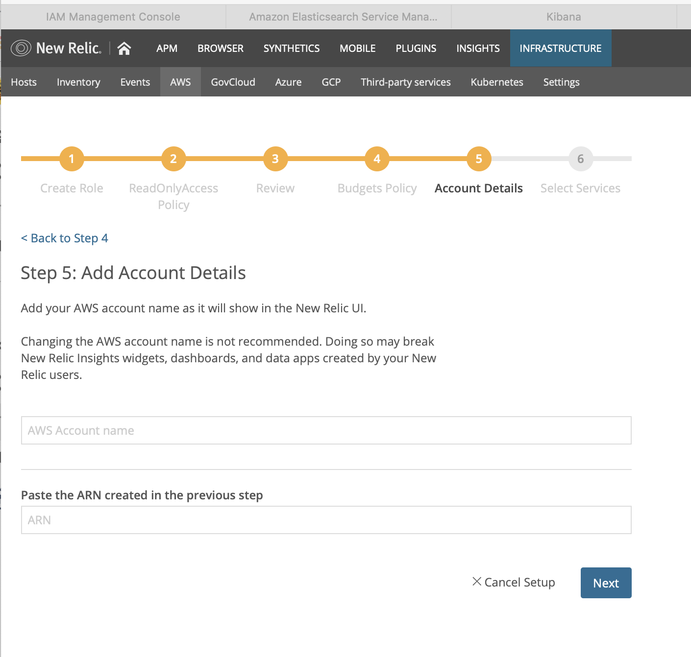
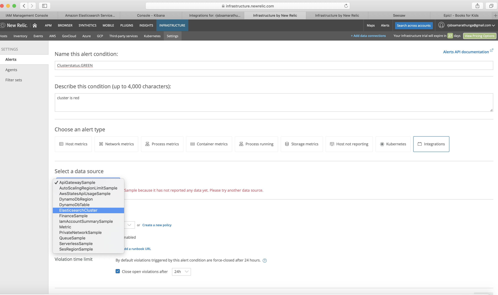

# Setup Elastisearch alerts in Newrelic
## Setting up newrelic

In newrelic provider you can specify `api_key` - (Required except for newrelic_insights_event resource) Your New Relic API key. The `NEWRELIC_API_KEY` environment variable can also be used.

The API key creation instructions: https://docs.newrelic.com/docs/apis/get-started/intro-apis/understand-new-relic-api-keys#user-api-key

what you need is an ADMIN Api key. 

To create one:
-  go to https://rpm.newrelic.com/accounts/2729161/integrations?page=api_keys
- click refresh button in admin table under your row name to generate a key
- copy it and add to tf script


```json
provider "newrelic" {
  api_key = "${var.newrelic_api_key}"
}

variable "newrelic_api_key" {
    default = "NRAA-xxx"
  
}
```

## add aws account to newrelic (personal)

`newrelic > infrastructure > aws > Elasticsearch Service `

shows following:


### Step 1: Create a role and establish trust

Use the AWS IAM console to `create a new role`. This will allow New Relic Infrastructure to securely retrieve monitoring data from your AWS account. You’ll find more details in our 
documentation
.
To get started, open the IAM Console and click the blue Create Role button. 

- Select the following role type: Another AWS account.
- Enter  the Account ID.
- Check the box in order to Require external ID.
- Enter the External ID.
- Click Next: Permissions.

### Step 2: Attach policy

Enter ReadOnlyAccess into the search box.
Check the box for the ReadOnlyAccess policy.
Click Next: Review.


### Step 3: Set role name and review

Tip: New Relic HIGHLY RECOMMENDS using the role name `NewRelicInfrastructure-Integrations`. This name will show in the IAM console, and it should be something that reminds you that this role exists to grant New Relic Infrastructure access to monitor your AWS account.

Enter NewRelicInfrastructure-Integrations for the Role name.
Click Create Role.
Copy the Role ARN:
Select the role you have just created and enter the properties screen.
Select the entire Role ARNand copy it (you'll need it in the next step).


### Step 4: Configure Budgets policy

Tip: Enabling budgets allows New Relic to capture service consumptions as well as usage and costs information for the budgets you configured in AWS - this is an optional but recommended step that allows you to get financial data alongside your performance monitoring.

While you are in the properties role properties view, Add inline policy in the Permissions tab.
Create a policy for the Budget service, and allow the ViewBudget read permission for all resources. You can use the below permission statement in JSON:

```JSON
{
  "Statement": [
    {
      "Action": [
        "budgets:ViewBudget"
      ],
      "Effect": "Allow",
      "Resource": "*"
    }
  ],  
  "Version": "2012-10-17"
}
```

Enter a Name for the policy (i.e.: NewRelicBudget).
Click on Create policy.


### Step 5: Add Account Details

Add your AWS account name as it will show in the New Relic UI (can be found in aws console > my account >account settings).

Changing the AWS account name is not recommended. Doing so may break New Relic Insights widgets, dashboards, and data apps created by your New Relic users.

paste in below:


### Step 6: Select Services

select only elasticsearch service> Next


now in `newrelic > infrastructure > aws`  you should see `dashboard` and `confugire` links for elasticsearch.


click `configure` link and turn on `Collect node data` 
## References
https://www.terraform.io/docs/providers/newrelic/index.html
https://www.terraform.io/docs/providers/newrelic/guides/getting_started.html
https://www.terraform.io/docs/providers/newrelic/r/infra_alert_condition.html


Now in dashboard (https://infrastructure.newrelic.com/accounts/2729161/integrations/aws/accounts/37068/elasticsearch/dashboard) you should see data in graphs:


## Creatting alerts

let's see how to manually create ealsticsearch alerts:

newrelic > infrastructure> aws > elasticsearch dashboard > create alert:

- Choose an alert type: Integrations
- Select a data source: ElasticsearchCluster

- Narrow down entities > Filter Entities > attributes > domain name > select audience (domain name of my es instance)
  
- Define thresholds
  select metric:
  

  
  
  

- configure
  configuration:
   
   click on create new policy > give name and email > create:
   

  This creates alert condition:
  

Clicking on green-status-policy shows:


Also look at API: https://docs.newrelic.com/docs/infrastructure/new-relic-infrastructure/infrastructure-alert-conditions/rest-api-calls-new-relic-infrastructure-alerts

https://rpm.newrelic.com/api/explore/alerts_conditions/list


https://www.terraform.io/docs/providers/newrelic/guides/getting_started.html

## Using terraform

https://www.terraform.io/docs/providers/newrelic/guides/getting_started.html

Newrelic Elasticsearch metrics list: 
https://docs.newrelic.com/docs/integrations/amazon-integrations/aws-integrations-list/aws-elasticsearch-monitoring-integration

https://docs.newrelic.com/docs/integrations/host-integrations/host-integrations-list/elasticsearch-monitoring-integration

https://blog.newrelic.com/engineering/observability-as-code-new-relic-terraform-provider/

The metric that needs to be in the select metric in terraform infra alert condition can be found by manually creating a new policy and viewing it shows what to use:

e.g. clusterstatus.green maps to `provider.ClusterStatus.green.Maximum` in terraform:

https://alerts.newrelic.com/accounts/2729161/policies/798493


```json
provider "newrelic" {
  api_key = "${var.newrelic_api_key}"
}

provider "aws" {
  region = "us-east-1"
}

terraform {
  required_version = ">= 0.11.0"
}

data "aws_region" "current" {}

data "aws_caller_identity" "current" {}

// ELASTICSEARCH
variable "domain" {
  default = "audience"
}

variable "newrelic_api_key" {
  default = "NRAA-xxx"
}

resource "aws_elasticsearch_domain" "example" {
  domain_name           = "${var.domain}"
  elasticsearch_version = "6.4"

  cluster_config {
    instance_type = "t2.small.elasticsearch"
  }

  ebs_options {
    ebs_enabled = true
    volume_size = 10
  }

  snapshot_options {
    automated_snapshot_start_hour = 23
  }

  tags = {
    Domain = "TestDomain"
  }

  access_policies = <<POLICY
{
  "Version": "2012-10-17",
  "Statement": [
    {
      "Action": "es:*",
      "Principal": "*",
      "Effect": "Allow",
      "Resource": "arn:aws:es:${data.aws_region.current.name}:${data.aws_caller_identity.current.account_id}:domain/${var.domain}/*"
    }
  ]
}
POLICY
}

#  data "newrelic_application" "app_name" {
#    name = "audience" // Note: This must be an exact match of your app name in New Relic (Case sensitive)
#  }

resource "newrelic_alert_policy" "red_status_alert_policy" {
  name = "red_status_alert_policy"
}

resource "newrelic_infra_alert_condition" "cluster_status_red" {
  policy_id = "${newrelic_alert_policy.red_status_alert_policy.id}"

  name                 = "Cluster status red"
  type                 = "infra_metric"
  integration_provider = "ElasticsearchCluster"
  select               = "provider.ClusterStatus.green.Maximum"
  comparison           = "equal"
  where                = "(`provider.domainName` LIKE '%audience%')"

  critical {
    duration      = 5
    value         = 1
    time_function = "all"
  }
}

resource "newrelic_infra_alert_condition" "cluster_free_storage_space_too_low" {
  policy_id = "${newrelic_alert_policy.red_status_alert_policy.id}"

  name                 = "elasticsearch_cluster_free_storage_space_too_low"
  type                 = "infra_metric"
  integration_provider = "ElasticsearchCluster"
  select               = "provider.FreeStorageSpace.Minimum"
  comparison           = "below"
  where                = "(`provider.domainName` LIKE '%audience%')"

  critical {
    duration      = 5
    value         = 6000
    time_function = "all"
  }
}

# Notification channel
resource "newrelic_alert_channel" "alert_notification_email" {
  name = "dmrhimali@gmail.com"
  type = "email"

  config {
    recipients              = "xxx@gmail.com"
    include_json_attachment = "1"
  }
}

# Link the above notification channel to your policy
resource "newrelic_alert_policy_channel" "alert_policy_email" {
  policy_id = "${newrelic_alert_policy.red_status_alert_policy.id}"

  channel_ids = [
    "${newrelic_alert_channel.alert_notification_email.id}",
  ]
}

```

https://docs.newrelic.com/docs/integrations/amazon-integrations/aws-integrations-list/aws-elasticsearch-monitoring-integration

https://www.terraform.io/docs/providers/newrelic/guides/getting_started.html

https://www.edureka.co/blog/amazon-cloudwatch-monitoring-tool/

https://www.youtube.com/watch?v=-rQku_AeN_Y

https://medium.com/@sujit_tripathy/configuring-new-relic-in-java-application-e2174cf1515

## S3 concat files

https://pypi.org/project/s3-concat/

https://github.com/whitfin/s3-concat

http://whitfin.io/quickly-concatenating-files-in-amazon-s3/

https://stackoverflow.com/questions/19290103/merging-files-on-aws-s3-using-apache-camel
 S3's multi-part upload API has a minimum file part size of 5MB

 https://github.com/xtream1101/s3-concat

 multipart upload limits to s3: https://docs.aws.amazon.com/AmazonS3/latest/dev/qfacts.html

